# Restaurando um backup físico em uma nova instância e em um mesmo servidor de produção<br>
##### Publicado em 26/01/2020 por [Michel Souza](https://www.linkedin.com/in/michel-ferreira-souza/)

Fala galera, uma das atividades que faço com frequência é clonagem de base de dados, seja o clone diante de um backup(```Backup-based duplication```) ou do banco de dados ativo (```active database duplication```). <br>
Neste artigo vou apresentar passo a passo como realizar uma clonagem de base diante do banco de dados ativo ou seja um ```active database duplication```. 

> *"A melhor forma de aprender é ensinando ou compartilhando conhecimento."* 

<font color="red" size="4"><strong>Observação: </strong>sugiro não sair executando o passo a passo deste artigo sem ler todo o conteúdo, pois o objetivo também é mostrar os erros cometidos na clonagem de base.</font><br>

## Cenário  
As empresas normalmente realizam clonagem de base para ambiente de teste ou treinamento com o intuito de manter os dados o mais próximo possível do ambiente de produção, utilizando para homologar uma atualização do sistema ou realizar procedimentos que não podem ser realizados em ambiente produtivo.

Para realizar a clonagem de base, tenho os seguintes ambientes.
> **Observação**: estou assumindo que você já tenha as duas instâncias criadas para realizar o procedimento. Caso a instância auxiliar não exista, pode-se criar utilizando DBCA ou no [modo silencioso](https://github.com/souzacristsf/article_database/blob/master/ORACLE/CREATEDB/silent.md). Outra forma é criar um **PFILE** e **SPFILE** para subir uma instância com o minimo de parâmetros possível, esse procedimento realizo neste [artigo](https://github.com/souzacristsf/article_database/blob/master/ORACLE/RESTORE/restore_backup_new_instance.md).

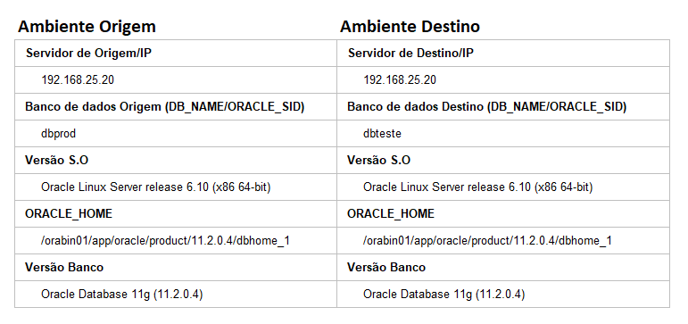 <br>
> **Observação**: nota-se que o processo está sendo executado no mesmo servidor do banco de dados de origem, tenha um backup disponivel e atualizado do ambiente produtivo.

Para iniciarmos a clonagem de base é necessário que o banco auxiliar(ambiente destino) não esteja montado, ou seja tem que estar no estágio **STARTED**, conforme imagem abaixo.<br>
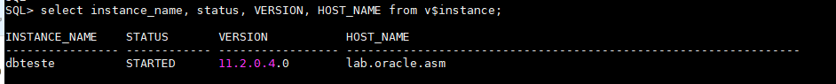

Depois de realizar um backup do ambiente de produção, inicia-se o processo de clonagem de base, conectamos no ambiente target e auxiliar da seguinte forma.
```bas
rman target sys/891866@dbprod auxiliary sys/891866@dbteste
```
Tem-se o <font color="red" size="5"><strong>Erro</strong></font> abaixo para tratar.<br>
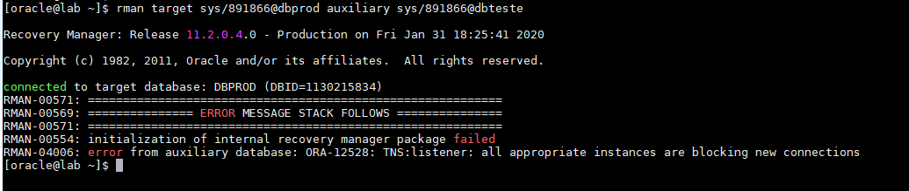 <br>
> **Observação**: O erro acima é bem claro, nota-se que não foi possivel conectar no ambiente auxiliar(dbteste), devido o bloqueio de novas conexões, ou seja para dar continuidade a clonagem de base é necessario registramos o serviço estático no listener, assim conseguimos conectar na instância em qualquer estágio (DOWN, NOMOUNT, MOUNT ou OPEN).

Se verifcar o status do listener com o comando ```lsnrctl status```, obtem-se as seguintes informações. Para a instância dbteste o serviço está com o status **blocked**. <br>
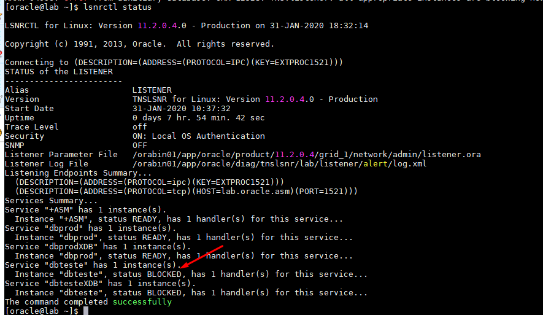

Realizando a conexão na instância **DBTESTE** utilizando ```Local Naming```, tem-se o mesmo erro. <br>
Tem-se o <font color="red" size="5"><strong>Erro</strong></font> abaixo para tratar.<br>
```sql
[oracle@lab ~]$ sqlplus sys/891866@dbteste as sysdba

SQL*Plus: Release 11.2.0.4.0 Production on Fri Jan 31 18:42:45 2020

Copyright (c) 1982, 2013, Oracle.  All rights reserved.

ERROR:
ORA-12528: TNS:listener: all appropriate instances are blocking new connections

Enter user-name:
```
Se tentarmos conectar via ```easy connect``` gera o mesmo erro. 
```sql
[oracle@lab ~]$ sqlplus sys/891866@192.168.25.20:1521/dbteste as sysdba

SQL*Plus: Release 11.2.0.4.0 Production on Fri Jan 31 19:01:48 2020

Copyright (c) 1982, 2013, Oracle.  All rights reserved.

ERROR:
ORA-12528: TNS:listener: all appropriate instances are blocking new connections

Enter user-name: 
```
A única forma que conseguimos conectar na instância ```dbteste``` é utilizando conexão local. Para mais informação para metodos de conexão, veja o [link](https://docs.oracle.com/database/121/NETAG/naming.htm#NETAG277)

```sql
[oracle@lab ~]$ . oraenv <<< dbteste
ORACLE_SID = [dbteste] ? The Oracle base remains unchanged with value /orabin01/app/oracle
[oracle@lab ~]$ sqlplus / as sysdba

SQL*Plus: Release 11.2.0.4.0 Production on Fri Jan 31 19:04:59 2020

Copyright (c) 1982, 2013, Oracle.  All rights reserved.

Connected to:
Oracle Database 11g Enterprise Edition Release 11.2.0.4.0 - 64bit Production
With the Partitioning, OLAP, Data Mining and Real Application Testing options

SQL> 
```

Para resolver o erro **ORA-12528** é necessário realizar o registro no listener, conforme imagem abaixo.
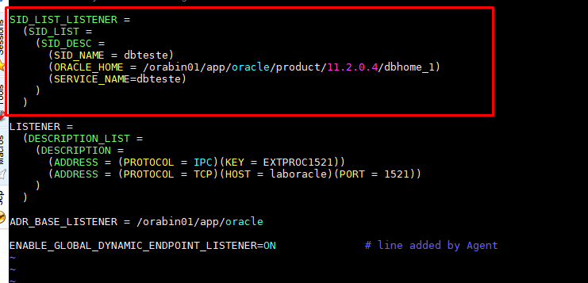 <br>
O listener é responsável por manter e estabelecer conexões entre um cliente(Host do usuário ou servidor de aplicação) e o servidor de banco de dados Oracle, contudo, o listener é um processo do Oracle Net Services que gerencia conexões entre as aplicações e o servidor de banco de dados, entenda mais sobre o listener [aqui](https://docs.oracle.com/cd/E11882_01/network.112/e41945/listenercfg.htm#NETAG010).

Depois de registrar o serviço **dbteste** no listener.ora é necessário realizar o comando ```lsnrctl stop``` e ```lsnrctl start```, parando e iniciando o listenar. Nota-se na imagem abaixo a presença do status **UNKNOWN** para o serviço da instância **dbteste**.<br>
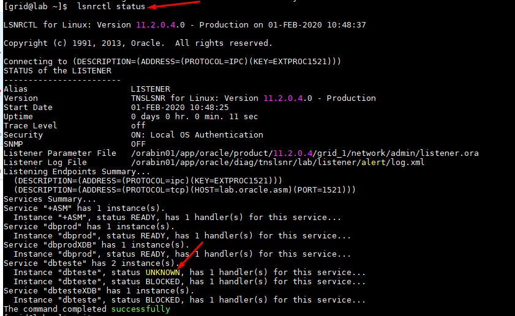 <br>

Agora é possível conectar na instância através do listener e iniciar a clonagem de base, como mostra a imagem abaixo. <br>
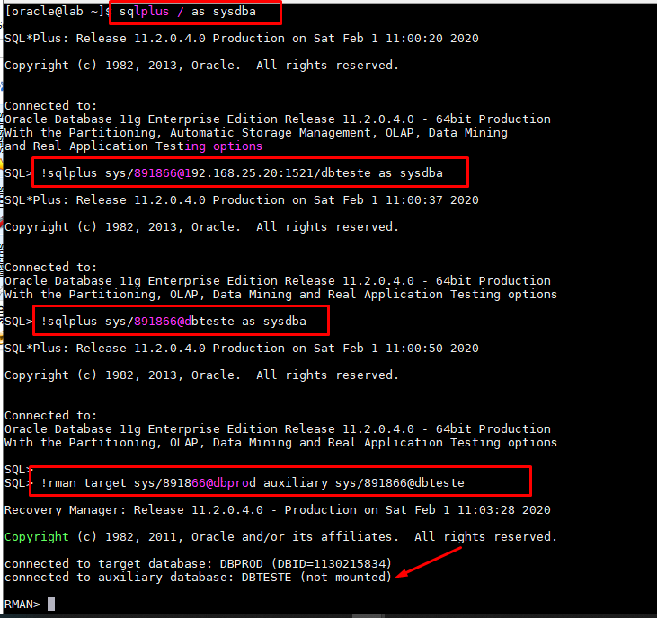 <br>

## Iniciando a clonagem de base 

Para realizar a clonagem de base usando a opção ```active database duplication``` é necessário informar alguns parâmetros e existem duas opções para o procedimento. 

 1) Utilizar a opção SPFILE, sentando os parâmetros no comando duplicate.
 2) Realizar a clonagem de base com SPFILE ativo na instância auxiliar.

### Realizando o duplicate informando os parâmetros explicitamente no comando
Nesta seção vamos informar a opção SPFILE no comando duplicate e o parâmentros que compõem o spfile, segue a [Doc ID 1401333.1](https://support.oracle.com/epmos/faces/DocumentDisplay?_afrLoop=40484496464427&parent=EXTERNAL_SEARCH&sourceId=PROBLEM&id=1401333.1&_afrWindowMode=0&_adf.ctrl-state=r1iw3j6l4_53) e [Doc ID 1439632.1](https://support.oracle.com/epmos/faces/DocumentDisplay?_afrLoop=40473371771033&parent=EXTERNAL_SEARCH&sourceId=PROBLEM&id=1439632.1&_afrWindowMode=0&_adf.ctrl-state=r1iw3j6l4_4) com mais detalhes dos parâmetros necessários para um duplicate.<br>

Veja os possíveis erros cometidos no procedimento de duplicação de base.<br>

<font color="red"><strong>ATENÇÃO: estou realizando o procedimento em um ambiente de teste, leia todo o artigo antes de sair executando os comandos.</strong></font><br> 

Como comentado é importante informar alguns parâmetros no comando do duplicate. Segue quais os parâmetro são necessários: <br>
- DB_NAME
- DB_UNIQUE_NAME
- CONTROL_FILES
- DIAGNOSTIC_DEST
- LOG_FILE_NAME_CONVERT
- DB_FILE_NAME_CONVERT 
- LOG_ARCHIVE_DEST

Veja no comando abaixo que podemos utilizar outros parâmetros que compõem o SPFILE para iniciar a clonagem de base.
```sql
run {
allocate channel ch1 type disk;
allocate auxiliary channel ch2 type disk;
SQL 'alter system switch logfile';
duplicate target database to dbteste from active database
SPFILE
SET DB_NAME='dbteste'
SET DB_UNIQUE_NAME='dbteste'
SET CONTROL_FILES='+DGDATA/dbteste/controlfile/control01.ctl','+DGRECO/dbteste/controlfile/control02.ctl'
set SGA_TARGET='1024M'
set PGA_AGGREGATE_TARGET='512M'
SET DIAGNOSTIC_DEST='/orabin01/app/oracle'
SET DB_FILE_NAME_CONVERT='+DGDATA/dbprod/','+DGDATA/dbteste/'
SET LOG_FILE_NAME_CONVERT='+DGRECO/dbprod/','+DGRECO/dbteste/'
SET LOG_ARCHIVE_FORMAT='dbteste_%t_%s_%r.arc'
set LOG_ARCHIVE_DEST='/orabin01/dbteste/archive/';
}
```
Ao executar o comando acima, recebemos o seguinte erro, conforme apresenta a imagem abaixo. <br>
Tem-se o <font color="red" size="5"><strong>Erro</strong></font> abaixo para tratar.<br>
 <br>

O erro acima é obtido pelo fato que a instância **dbteste** já possui um SPFILE parâmetrizado, conforme visto no comando abaixo na instância. 
```sql
SQL> show parameter spfile

NAME              TYPE          VALUE
---------------   -----------   ------------------------------
spfile            string        +DGDATA/dbteste/spfiledbteste.ora
```
Para resolver esse problema é necessario subir a instância **dbteste** com um PFILE, ou seja vamos iniciar a instância com pfile existente e com isso o parâmetro spfile não será setado.

Primeiro é importante sempre salvar um copia e pfile a partir do spfile. 
```sql
SQL> create pfile='?/dbs/initdbtestenew.ora' from spfile;

File created.
```
Agora podemos subir a instância dbteste com a cópia do pfile localizado no diretório ```$ORACLE_HOME/dbs```, conforme comando abaixo.
```sql
SQL> startup nomount pfile=?/dbs/initdbtestenew.ora
ORACLE instance started.

Total System Global Area 1603411968 bytes
Fixed Size                  2253664 bytes
Variable Size             520096928 bytes
Database Buffers         1073741824 bytes
Redo Buffers                7319552 bytes

SQL> show parameter spfile

NAME              TYPE          VALUE
---------------   -----------   ------------------------------
spfile            string        
```
Nota-se que o parâmetro SPFILE não tem valor setado.
Vamos executar o comando abaixo para iniciar novamente o duplicate, veja que agora no parâmetro ```CONTROL_FILES````estou setando apenas a nome do diskgroup ```+DGDATA```, pelo fato que já existe controlfile criados para a instância dbteste.
```sql
run {
allocate channel ch1 type disk;
allocate auxiliary channel ch2 type disk;
SQL 'alter system switch logfile';
duplicate target database to dbteste from active database
SPFILE
SET DB_NAME='dbteste'
SET DB_UNIQUE_NAME='dbteste'
SET CONTROL_FILES='+DGDATA'
set SGA_TARGET='1024M'
set PGA_AGGREGATE_TARGET='512M'
SET DIAGNOSTIC_DEST='/orabin01/app/oracle'
SET DB_FILE_NAME_CONVERT='+DGDATA/dbprod/','+DGDATA/dbteste/'
SET LOG_FILE_NAME_CONVERT='+DGRECO/dbprod/','+DGRECO/dbteste/'
SET LOG_ARCHIVE_FORMAT='dbteste_%t_%s_%r.arc'
set LOG_ARCHIVE_DEST='/orabin01/dbteste/archive/';
}
```
Com o intuito de reproduzir novos erros no processo de clonagem de base, depois de executar o comando acima caso não tenha espaço no diskgroup que irá armazenar os datafiles da base de dbteste, tem-se o seguinte erro abaixo.
> **Observação:** estou utilizando o mesmo diskgroup DGDATA do ambiente produtivo, é necessário analisar o espaço antes de iniciar qualquer carga de base. 

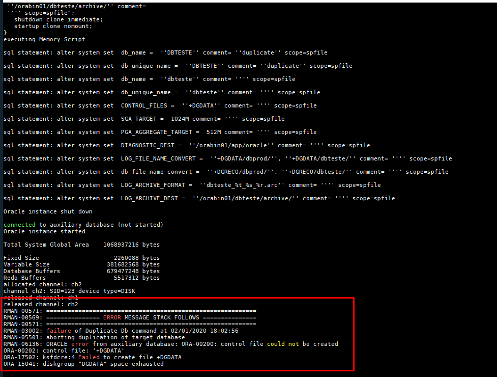 <br>

Visto que o Rman identificou que não tem espaço no **DGDATA**, realizei a remoção dos datafiles de forma manual no caminho **+DGDATA/dbteste/datafile/** com o comando ```rm *.dbf``` para obtermos novos erros, mas é necessários adicionar mais espaço no diskgroup para a carga finalizar com sucesso.

Executando novamente o comando duplicate, obtemos um novo erro, conforme mostra a imagem abaixo.  
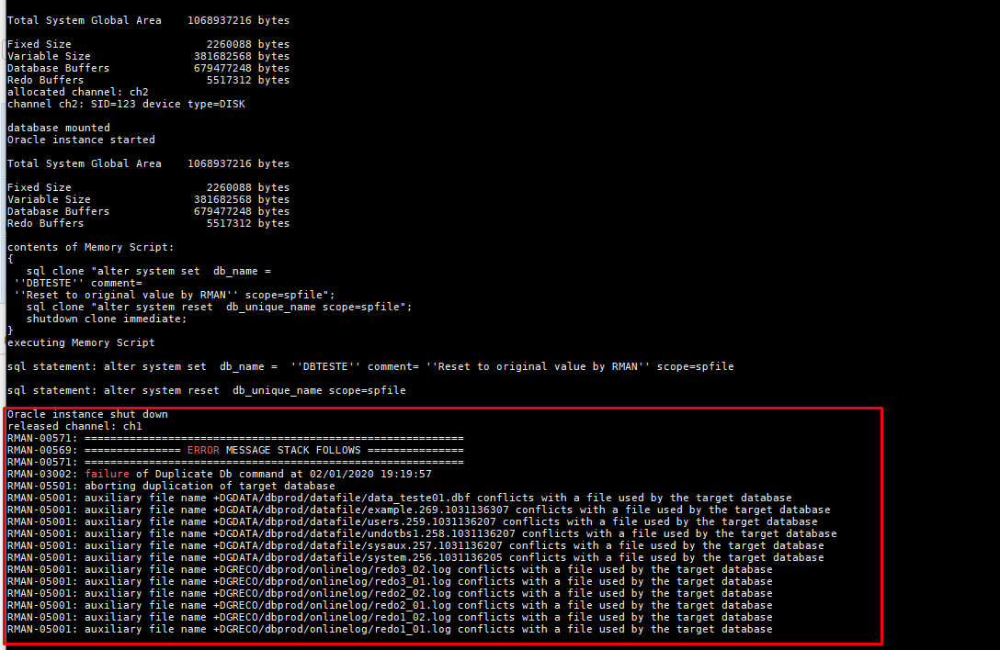 <br>
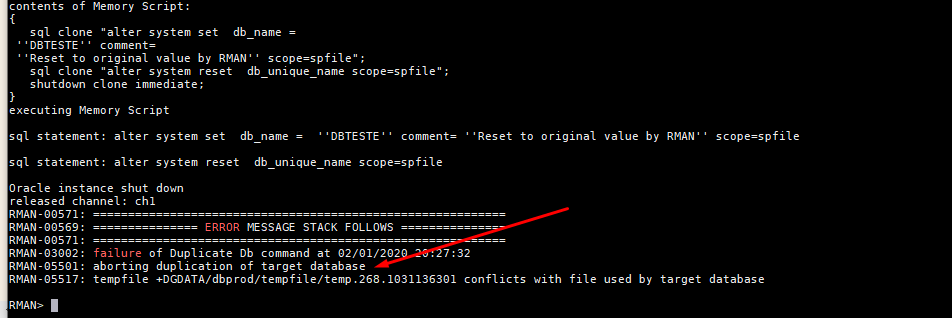 <br>
> **Observação:** os erros na imagem acim é devido os parâmetros **LOG_FILE_NAME_CONVERT** **DB_FILE_NAME_CONVERT**, não estarem mapeado de acordo com o caminho "diretório absoluto". Como não estamos utilizando OMF (Oracle Managed Files) é necesário informar a diretório completo nos parâmetros db_file_name_convert e log_file_name_convert.

Alterando novamente o comando duplicate, tem-se o novo comando abaixo para a clonagem de base. Observe que agora estamos adicionando também o diretório do tempfile.
```sql
run {
allocate channel ch1 type disk;
allocate auxiliary channel ch2 type disk;
SQL 'alter system switch logfile';
duplicate target database to dbteste from active database
SPFILE
SET DB_NAME='dbteste'
SET DB_UNIQUE_NAME='dbteste'
SET CONTROL_FILES='+DGDATA'
set SGA_TARGET='1024M'
set PGA_AGGREGATE_TARGET='512M'
SET DIAGNOSTIC_DEST='/orabin01/app/oracle'
SET DB_FILE_NAME_CONVERT='+DGDATA/dbprod/datafile/','+DGDATA/dbteste/datafile/', '+DGDATA/dbprod/tempfile/','+DGDATA/dbteste/tempfile/'
SET LOG_FILE_NAME_CONVERT='+DGRECO/dbprod/onlinelog/','+DGRECO/dbteste/onlinelog/'
SET LOG_ARCHIVE_FORMAT='dbteste_%t_%s_%r.arc'
set LOG_ARCHIVE_DEST='/orabin01/dbteste/archive/';
}
```
<font color="red" size="4"><strong>Obsevarção importante: </strong> Nota-se nas imagens abaixo que a clonagem de base falhou por falta de espaço em disco, e mesmo assim foi possível copiar três datafiles no diskgroup DGDATA, visto que as instâncias DBPROD e DBTESTE, estão utilizando o mesmo diskgroup, ou seja mesmo falhando o RMAN não excluir os datafiles já copiados, isso pode fazer com que o ambiente de produão fique indisponível por falta de espaço em disco.</font><br>

Cópia dos datafiles na instância dbteste no DGDATA.
```bash
ASMCMD> pwd
+DGDATA/DBTESTE/DATAFILE
ASMCMD>
ASMCMD> ls
SYSAUX.292.1031260159
UNDOTBS1.295.1031260173
USERS.296.1031260191
ASMCMD>
```

Erro por falta de espaço em disco, informação log RMAN.
 <br>
Erro por falta de espaço no DGDATA, informação alertlog.
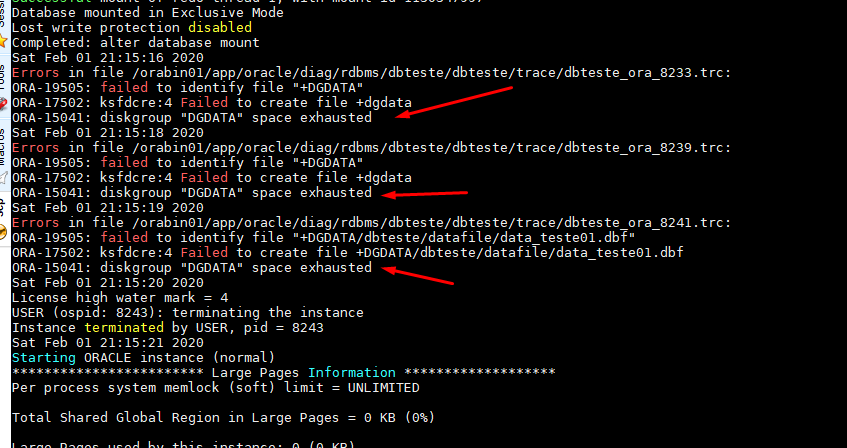 <br>

Agora o que resta é adicionar mais LUN's e reconhecer no banco de dados no diskgroup DGDATA, o que farei na próxima seção. 

#### Ajustando espaço no diskgroup DGDATA
A imagem abaixo apresenta o espaço disponível no DGDATA e DGRECO e o percentual já utilizado. Percebe-se a disponibilidade de dois discos como ```PROVISIONED```, irei utilizar o path **/dev/oracleasm/disks/DGDATA2** e apresentar o disco no banco de dados. <br>
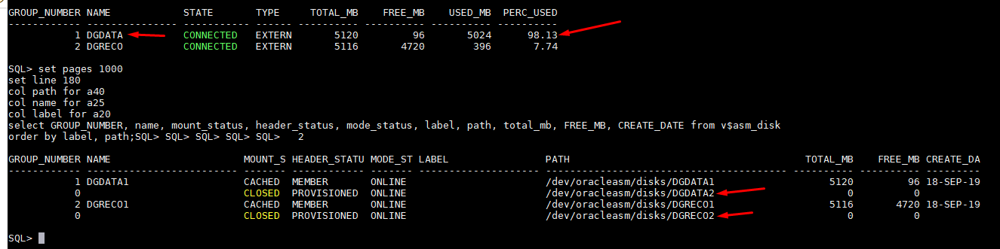 <br>

Conectando na instância ```+ASM``` com **sysasm**, utizamos o comando abaixo para apresentar o disco no DGDATA.
```sql
SQL> alter diskgroup DGDATA add disk '/dev/oracleasm/disks/DGDATA2' NAME DGDATA2;

Diskgroup altered.
```
Verificando o espaço disponível no DGDATA.
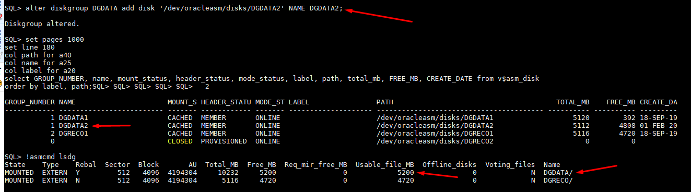 <br>

Depois de adicionar o espaço no diskgroup DGDATA, podemos continuar a clonagem de base com o comando abaixo.
```sql
run {
allocate channel ch1 type disk;
allocate auxiliary channel ch2 type disk;
SQL 'alter system switch logfile';
duplicate target database to dbteste from active database
SPFILE
SET DB_NAME='dbteste'
SET DB_UNIQUE_NAME='dbteste'
SET CONTROL_FILES='+DGDATA'
set SGA_TARGET='1024M'
set PGA_AGGREGATE_TARGET='512M'
SET DIAGNOSTIC_DEST='/orabin01/app/oracle'
SET DB_FILE_NAME_CONVERT='+DGDATA/dbprod/datafile/','+DGDATA/dbteste/datafile/', '+DGDATA/dbprod/tempfile/','+DGDATA/dbteste/tempfile/'
SET LOG_FILE_NAME_CONVERT='+DGRECO/dbprod/onlinelog/','+DGRECO/dbteste/onlinelog/'
SET LOG_ARCHIVE_FORMAT='dbteste_%t_%s_%r.arc'
set LOG_ARCHIVE_DEST='/orabin01/dbteste/archive/';
}
```

<font color="gree" size="4"><strong>Parabéns</strong> 👏👏👏👏.</font><br>
Depois de tratar os erros possíveis na clonagem de base, conforme o log abaixo do RMAN, clonagem finalizada com sucesso!!!
Veja o log completo aqui.  

```sql
datafile 5 switched to datafile copy
input datafile copy RECID=4 STAMP=1031266543 file name=+DGDATA/dbteste/datafile/example.302.1031266479
datafile 6 switched to datafile copy
input datafile copy RECID=5 STAMP=1031266543 file name=+DGDATA/dbteste/datafile/data_teste01.dbf
datafile 2 switched to datafile copy
input datafile copy RECID=6 STAMP=1031266543 file name=+DGDATA/dbteste/datafile/sysaux.292.1031260159
datafile 3 switched to datafile copy
input datafile copy RECID=7 STAMP=1031266543 file name=+DGDATA/dbteste/datafile/undotbs1.295.1031260173
datafile 4 switched to datafile copy
input datafile copy RECID=8 STAMP=1031266543 file name=+DGDATA/dbteste/datafile/users.296.1031260191

contents of Memory Script:
{
   Alter clone database open resetlogs;
}
executing Memory Script

database opened
Finished Duplicate Db at 01-FEB-20
released channel: ch1
released channel: ch2

RMAN>
```

### Realizando o duplicate com SPFILE setado na instância dbteste

<font color="red"><strong>ATENÇÃO: estou realizando o procedimento em um ambiente de teste, leia todo o artigo antes de sair executando os comandos.</strong></font><br> 

Para iniciar a clonagem de base, pode-se utilizar o comando abaixo. Nota-se o uso de alocação de canal no bloco do Rman, [aqui](https://docs.oracle.com/html/E10643_07/rcmsynta004.htm) 

```sql
run {
    allocate channel aux1 type disk;
    allocate auxiliary channel aux2 type disk;
    SQL 'alter system switch logfile';
    duplicate target database to dbteste from active database;
}
```
Ao executar o comando acima, é emitido o seguinte erro no RMAN. <font color="red"><strong>CUIDADO!!! Não faça isso em um ambiente de produção.</strong></font><br>
Tem-se o <font color="red" size="5"><strong>Erro</strong></font> abaixo para tratar.<br>
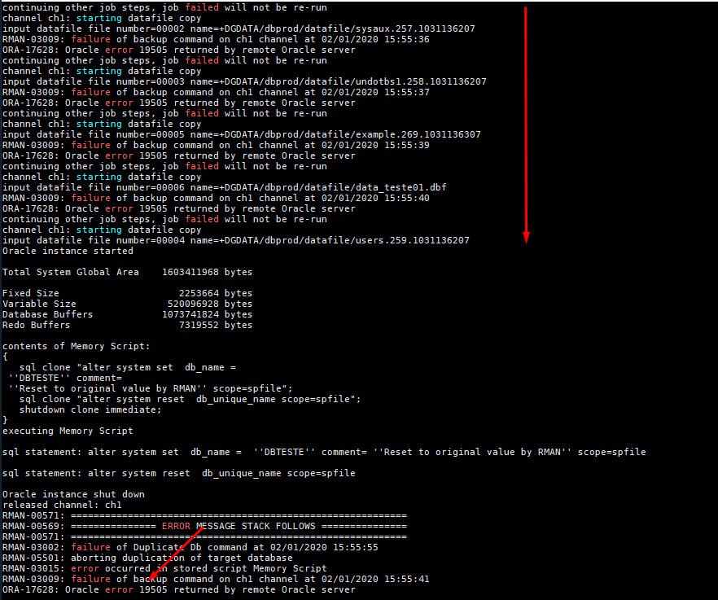 <br>