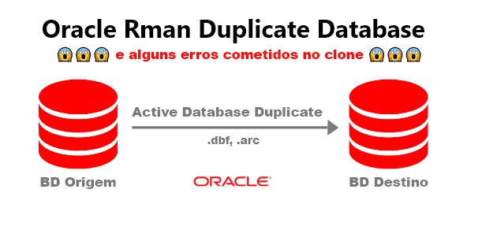
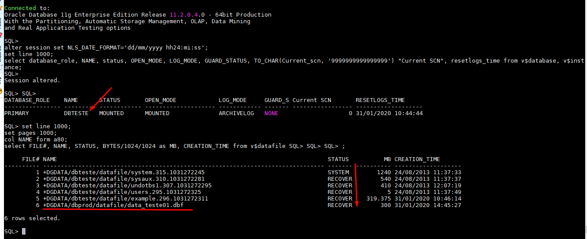
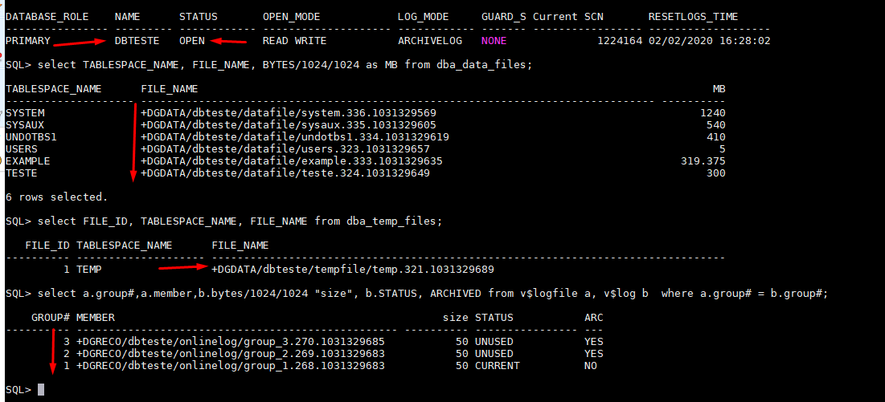

# Realizando um Active Database Duplication no mesmo servidor e solucionando alguns erros cometidos no clone.<br>
##### Publicado em 01/02/2020 por [Michel Souza](https://www.linkedin.com/in/michel-ferreira-souza/)

Fala galera, uma das atividades que faço com frequência é clonagem de base de dados, seja o clone diante de um backup(```Backup-based duplication```) ou do banco de dados ativo (```active database duplication```). <br>
Neste artigo vou apresentar passo a passo como realizar uma clonagem de base, diante do banco de dados ativo ou seja um ```active database duplication```. 

> *"A melhor forma de aprender é ensinando ou compartilhando conhecimento."* 

<font color="red" size="4"><strong>Observação: </strong>sugiro não sair executando o passo a passo deste artigo sem ler todo o conteúdo, pois o objetivo também é mostrar os erros possíveis na clonagem de base.</font><br>

## Cenário  
As empresas normalmente realizam clonagem de base para ambiente de teste ou treinamento com o intuito de manter os dados o mais próximo possível do ambiente de produção, utilizando-o para homologar uma atualização do sistema ou realizar procedimentos que não podem ser realizados em ambiente produtivo.

Para realizar a clonagem de base, tenho os seguintes ambientes.
> **Observação**: estou assumindo que você já tenha as duas instâncias criadas para realizar o procedimento. Caso a instância auxiliar não exista, pode-se criar utilizando DBCA ou no [modo silencioso](https://github.com/souzacristsf/article_database/blob/master/ORACLE/CREATEDB/silent.md). Outra forma é criar um **PFILE** e **SPFILE** para subir uma instância com o minimo de parâmetros possível, esse procedimento realizo neste [artigo](https://github.com/souzacristsf/article_database/blob/master/ORACLE/RESTORE/restore_backup_new_instance.md).

 <br>
> **Observação**: nota-se que o processo está sendo executado no mesmo servidor do banco de dados de origem, tenha um backup disponivel e atualizado do ambiente produtivo.

No processo do clone com o Rman, se faz necessário as duas instância terem as mesmas senhas para o usúario **SYS**, verifique se a instância auxiliar possui o arquivo de senha, caso não exista é necessário criar o arquivo. Veja nesse [link](https://www.thegeekdiary.com/how-to-create-the-oracle-password-file-using-orapwd-command/) como criar o arquivo de senha ou copie o arquivo do ambiente origem/target  localizado no ```$ORACLE_HOME/dbs/orapwSID```. <br>
O exemplo abaixo faz a cópia do arquivo de senha do ambiente origem/target para ambiente destino/auxiliar:
```bash
# Ambas instância estão no mesmo servidor e o arquivo de senha no filesystem local
cp $ORACLE_HOME/dbs/orapwdbprod  $ORACLE_HOME/dbs/orapwdbteste

# Ambas instância estão em servidores separados e o arquivo de senha no filesystem local
scp $ORACLE_HOME/dbs/orapwdbprod  oracle@192.168.20.15:/orabin01/app/oracle/product/11.2.0.4/dbhome_1/dbs/orapwdbteste
```

Para iniciarmos a clonagem de base é necessário que o banco auxiliar(ambiente destino) não esteja montado, ou seja tem que estar no estágio **STARTED**, conforme imagem abaixo.<br>


Depois de realizar um backup do ambiente de produção, inicia-se o processo de clonagem de base, conectamos no ambiente target e auxiliar da seguinte forma.
```bas
rman target sys/891866@dbprod auxiliary sys/891866@dbteste
```
Tem-se o <font color="red" size="5"><strong>Erro</strong></font> abaixo para tratar.<br>
 <br>
> **Observação**: O erro acima é bem claro, nota-se que não foi possivel conectar no ambiente auxiliar(dbteste), devido o bloqueio de novas conexões, ou seja para dar continuidade a clonagem de base é necessario registramos o serviço estático no listener, assim conseguimos conectar na instância em qualquer estágio (DOWN, NOMOUNT, MOUNT ou OPEN).

Se verifcar o status do listener com o comando ```lsnrctl status```, obtem-se as seguintes informações. Para a instância dbteste o serviço está com o status **blocked**. <br>


Realizando a conexão na instância **DBTESTE** utilizando ```Local Naming```, tem-se o mesmo erro. <br>
Tem-se o <font color="red" size="5"><strong>Erro</strong></font> abaixo para tratar.<br>
```sql
[oracle@lab ~]$ sqlplus sys/891866@dbteste as sysdba

SQL*Plus: Release 11.2.0.4.0 Production on Fri Jan 31 18:42:45 2020

Copyright (c) 1982, 2013, Oracle.  All rights reserved.

ERROR:
ORA-12528: TNS:listener: all appropriate instances are blocking new connections

Enter user-name:
```
Se tentarmos conectar via ```easy connect``` gera o mesmo erro. 
```sql
[oracle@lab ~]$ sqlplus sys/891866@192.168.25.20:1521/dbteste as sysdba

SQL*Plus: Release 11.2.0.4.0 Production on Fri Jan 31 19:01:48 2020

Copyright (c) 1982, 2013, Oracle.  All rights reserved.

ERROR:
ORA-12528: TNS:listener: all appropriate instances are blocking new connections

Enter user-name: 
```
A única forma que conseguimos conectar na instância ```dbteste``` é utilizando conexão local. Para mais informação para metodos de conexão, veja o [link](https://docs.oracle.com/database/121/NETAG/naming.htm#NETAG277)

```sql
[oracle@lab ~]$ . oraenv <<< dbteste
ORACLE_SID = [dbteste] ? The Oracle base remains unchanged with value /orabin01/app/oracle
[oracle@lab ~]$ sqlplus / as sysdba

SQL*Plus: Release 11.2.0.4.0 Production on Fri Jan 31 19:04:59 2020

Copyright (c) 1982, 2013, Oracle.  All rights reserved.

Connected to:
Oracle Database 11g Enterprise Edition Release 11.2.0.4.0 - 64bit Production
With the Partitioning, OLAP, Data Mining and Real Application Testing options

SQL> 
```

Para resolver o erro **ORA-12528** é necessário realizar o registro no listener, conforme imagem abaixo.
> **Observação**: caso realize o procedimento em servidores diferentes é necessário registrar no listener o serviço de cada instância. 

 <br>
O listener é responsável por manter e estabelecer conexões entre um cliente(Host do usuário ou servidor de aplicação) e o servidor de banco de dados Oracle, contudo, o listener é um processo do Oracle Net Services que gerencia conexões entre as aplicações e o servidor de banco de dados, entenda mais sobre o listener [aqui](https://docs.oracle.com/cd/E11882_01/network.112/e41945/listenercfg.htm#NETAG010).

Depois de registrar o serviço **dbteste** no listener.ora é necessário realizar o comando ```lsnrctl stop``` e ```lsnrctl start```, parando e iniciando o listenar. Nota-se na imagem abaixo a presença do status **UNKNOWN** para o serviço da instância **dbteste**.<br>
 <br>

Agora é possível conectar na instância através do listener e iniciar a clonagem de base, como mostra a imagem abaixo. <br>
 <br>

# Iniciando a clonagem de base 

Para realizar a clonagem de base usando a opção ```active database duplication``` é necessário informar alguns parâmetros e de acordo com os testes realizados, existem quatro opções para realizar o ```mapeando dos arquivos físicos (datafiles)``` para o ambiente auxiliar/destino, segue em detalhes. <br>
Realizar a clonagem de base: 
 1) Utilizando a cláusula SPFILE, essa opção no bloco ```run{}``` DUPLICATE restaurará o spfile do banco de dados de origem e será usado pelo banco de dados clone, depois de restaurado o spfile, pode-se setar os parâmetros explicitamente no comando duplicate, como por exemplo os parâmetros db_file_name_convert e log_file_name_convert.
 2) Utilizando o SPFILE ativo na instância auxiliar. Com o comando ```alter system set```, definindo os parâmetros db_file_name_convert e log_file_name_convert.
 3) Utilizando OMF (Oracle Managed Files), para usar essa opção é necessário que o parâmetro **db_create_file_dest** esteja setado, esse processo pode ser utilizado tanto no Item 1 e 2 e não é necessário informar o parâmetro db_file_name_convert.
 4) Utilizando o comando SET NEWNAME para mapear cada datafiles existem no ambiente origem/target para o ambiente destino/auxiliar.

## 1) Realizando o duplicate informando os parâmetros explicitamente no comando
Nesta seção vamos informar a opção SPFILE no comando duplicate e o parâmentros que compõem o spfile, segue a [Doc ID 1401333.1](https://support.oracle.com/epmos/faces/DocumentDisplay?_afrLoop=40484496464427&parent=EXTERNAL_SEARCH&sourceId=PROBLEM&id=1401333.1&_afrWindowMode=0&_adf.ctrl-state=r1iw3j6l4_53) e [Doc ID 1439632.1](https://support.oracle.com/epmos/faces/DocumentDisplay?_afrLoop=40473371771033&parent=EXTERNAL_SEARCH&sourceId=PROBLEM&id=1439632.1&_afrWindowMode=0&_adf.ctrl-state=r1iw3j6l4_4) com mais detalhes dos parâmetros necessários para um duplicate.<br>

Veja os possíveis erros cometidos no procedimento de duplicação de base.<br>

<font color="red"><strong>ATENÇÃO: estou realizando o procedimento em um ambiente de teste, leia todo o artigo antes de sair executando os comandos.</strong></font><br> 

Como comentado é importante informar alguns parâmetros no comando do duplicate. Segue quais os parâmetro são necessários: <br>
- DB_NAME
- DB_UNIQUE_NAME
- CONTROL_FILES
- DIAGNOSTIC_DEST
- LOG_FILE_NAME_CONVERT
- DB_FILE_NAME_CONVERT 
- LOG_ARCHIVE_DEST
- DB_CREATE_FILE_DEST   -- obs: usando essa opção, não precisa informar o db_file_name_convert.

Veja no comando abaixo que podemos utilizar outros parâmetros que compõem o SPFILE para iniciar a clonagem de base.
```sql
run {
    allocate channel ch1 type disk;
    allocate auxiliary channel ch2 type disk;
    SQL 'alter system switch logfile';
    duplicate target database to dbteste from active database
    SPFILE
    SET DB_NAME='dbteste'
    SET DB_UNIQUE_NAME='dbteste'
    SET CONTROL_FILES='+DGDATA/dbteste/controlfile/control01.ctl','+DGRECO/dbteste/controlfile/control02.ctl'
    set SGA_TARGET='1024M'
    set PGA_AGGREGATE_TARGET='512M'
    SET DIAGNOSTIC_DEST='/orabin01/app/oracle'
    SET DB_FILE_NAME_CONVERT='+DGDATA/dbprod/','+DGDATA/dbteste/'
    SET LOG_FILE_NAME_CONVERT='+DGRECO/dbprod/','+DGRECO/dbteste/'
    SET LOG_ARCHIVE_FORMAT='dbteste_%t_%s_%r.arc'
    set LOG_ARCHIVE_DEST='/orabin01/dbteste/archive/';
}
```
Ao executar o comando acima, recebemos o seguinte erro, conforme apresenta a imagem abaixo. <br>
Tem-se o <font color="red" size="5"><strong>Erro</strong></font> abaixo para tratar.<br>
 <br>

O erro acima é obtido pelo fato que a instância **dbteste** já possui um SPFILE parâmetrizado, conforme visto no comando abaixo na instância. 
```sql
SQL> show parameter spfile

NAME              TYPE          VALUE
---------------   -----------   ------------------------------
spfile            string        +DGDATA/dbteste/spfiledbteste.ora
```
Para resolver esse problema é necessario subir a instância **dbteste** com um PFILE, ou seja vamos realizar a cópia do spfile e iniciar a instância com pfile copiado, com isso o parâmetro spfile não será setado.

Para extrair os parâmetros do spfile e criar um novo pfile tanto para uso e cópia, utiza-se o comando abaixo. 
```sql
SQL> create pfile='?/dbs/initdbtestenew.ora' from spfile;

File created.
```
Agora podemos subir a instância dbteste com a cópia do pfile localizado no diretório ```$ORACLE_HOME/dbs```, conforme comando abaixo.
```sql
SQL> startup nomount pfile=?/dbs/initdbtestenew.ora
ORACLE instance started.

Total System Global Area 1603411968 bytes
Fixed Size                  2253664 bytes
Variable Size             520096928 bytes
Database Buffers         1073741824 bytes
Redo Buffers                7319552 bytes

SQL> show parameter spfile

NAME              TYPE          VALUE
---------------   -----------   ------------------------------
spfile            string        
```
Nota-se que o parâmetro SPFILE não tem valor setado.
Vamos executar o comando abaixo para iniciar novamente o duplicate, veja que agora no parâmetro ```CONTROL_FILES``` estou setando apenas a nome do diskgroup ```+DGDATA```, pelo fato que já existe controlfile criados para a instância dbteste e também mantermos a exclusividade do mesmo. <br>
Caso o controlfile não exista ou foi removido na instância auxiliar, colocar o valor absoluto no parâmentro CONTROL_FILES, por exemplo: ```CONTROL_FILES='+DGDATA/dbteste/controlfile/controlfile01.ctl'```.
```sql
run {
    allocate channel ch1 type disk;
    allocate auxiliary channel ch2 type disk;
    SQL 'alter system switch logfile';
    duplicate target database to dbteste from active database
    SPFILE
    SET DB_NAME='dbteste'
    SET DB_UNIQUE_NAME='dbteste'
    SET CONTROL_FILES='+DGDATA'
    set SGA_TARGET='1024M'
    set PGA_AGGREGATE_TARGET='512M'
    SET DIAGNOSTIC_DEST='/orabin01/app/oracle'
    SET DB_FILE_NAME_CONVERT='+DGDATA/dbprod/','+DGDATA/dbteste/'
    SET LOG_FILE_NAME_CONVERT='+DGRECO/dbprod/','+DGRECO/dbteste/'
    SET LOG_ARCHIVE_FORMAT='dbteste_%t_%s_%r.arc'
    set LOG_ARCHIVE_DEST='/orabin01/dbteste/archive/';
}
```
Com o intuito de reproduzir novos erros no processo de clonagem de base, depois de executar o comando acima caso não tenha espaço no diskgroup que irá armazenar os datafiles da base de dbteste, tem-se o seguinte erro abaixo.
> **Observação:** estou utilizando o mesmo diskgroup DGDATA do ambiente produtivo, é necessário analisar o espaço antes de iniciar qualquer carga de base. 

 <br>

Visto que o Rman identificou que não tem espaço no **DGDATA**, realizei a remoção dos datafiles de forma manual no caminho **+DGDATA/dbteste/datafile/** com o comando ```rm *.dbf``` para obtermos novos erros, mas é necessários adicionar mais espaço no diskgroup para a carga finalizar com sucesso.

Executando novamente o comando duplicate, obtemos um novo erro, conforme mostra a imagem abaixo.  
 <br>
 <br>
> **Observação:** os erros na imagem acima é devido os parâmetros **LOG_FILE_NAME_CONVERT** **DB_FILE_NAME_CONVERT**, não estarem mapeado de acordo com o caminho "diretório absoluto". Como não estamos utilizando OMF (Oracle Managed Files) é necesário informar a diretório completo nos parâmetros db_file_name_convert e log_file_name_convert. <br>
Contudo, existe a opção de uso do parâmetro ```PARAMETER_VALUE_CONVERT```, esse parâmetro é responsável por substituir qualquer string nos parâmetros do spfile de origem, exemplo: se adicionarmos o seguinte valor para o parâmetro ```PARAMETER_VALUE_CONVERT='dbprod','dbteste'```, caso o parâmetro **diagnostic_dest** foi defino como ```/<path>/dbprod/dump``` no spfile de origem. após o restore do spfile será modificado para ```/<path>/dbteste/dump```. 

Alterando novamente o comando duplicate, tem-se o novo comando abaixo para a clonagem de base. Observe que agora estamos adicionando também o diretório do tempfile.
```sql
run {
    allocate channel ch1 type disk;
    allocate auxiliary channel ch2 type disk;
    SQL 'alter system switch logfile';
    duplicate target database to dbteste from active database
    SPFILE
    SET DB_NAME='dbteste'
    SET DB_UNIQUE_NAME='dbteste'
    SET CONTROL_FILES='+DGDATA'
    set SGA_TARGET='1024M'
    set PGA_AGGREGATE_TARGET='512M'
    SET DIAGNOSTIC_DEST='/orabin01/app/oracle'
    SET DB_FILE_NAME_CONVERT='+DGDATA/dbprod/datafile/','+DGDATA/dbteste/datafile/', '+DGDATA/dbprod/tempfile/','+DGDATA/dbteste/tempfile/'
    SET LOG_FILE_NAME_CONVERT='+DGRECO/dbprod/onlinelog/','+DGRECO/dbteste/onlinelog/'
    SET LOG_ARCHIVE_FORMAT='dbteste_%t_%s_%r.arc'
    set LOG_ARCHIVE_DEST='/orabin01/dbteste/archive/';
}
```
<font color="red" size="4"><strong>Obsevarção importante: </strong> Nota-se nas imagens abaixo que a clonagem de base falhou por falta de espaço em disco, e mesmo assim foi possível copiar três datafiles no diskgroup DGDATA, visto que as instâncias DBPROD e DBTESTE, estão utilizando o mesmo diskgroup, ou seja mesmo falhando o RMAN não excluir os datafiles já copiados, isso pode fazer com que o ambiente de produão fique indisponível por falta de espaço em disco.</font><br>

Cópia dos datafiles na instância dbteste no DGDATA.
```bash
ASMCMD> pwd
+DGDATA/DBTESTE/DATAFILE
ASMCMD>
ASMCMD> ls
SYSAUX.292.1031260159
UNDOTBS1.295.1031260173
USERS.296.1031260191
ASMCMD>
```

Erro por falta de espaço em disco, informação log RMAN.
 <br>
Erro por falta de espaço no DGDATA, informação alertlog.
 <br>

Agora o que resta é adicionar mais LUN's e reconhecer no banco de dados no diskgroup DGDATA, o que farei na próxima seção. 

### Ajustando espaço no diskgroup DGDATA
A imagem abaixo apresenta o espaço disponível no DGDATA e DGRECO e o percentual já utilizado. Percebe-se a disponibilidade de dois discos como ```PROVISIONED```, irei utilizar o path **/dev/oracleasm/disks/DGDATA2** e apresentar o disco no banco de dados. <br>
 <br>

Conectando na instância ```+ASM``` com **sysasm**, utizamos o comando abaixo para apresentar o disco no DGDATA.
```sql
SQL> alter diskgroup DGDATA add disk '/dev/oracleasm/disks/DGDATA2' NAME DGDATA2;

Diskgroup altered.
```
Verificando o espaço disponível no DGDATA.
 <br>

Depois de adicionar o espaço no diskgroup DGDATA, podemos continuar a clonagem de base com o comando abaixo. <br>
<font color="green" size="4"><strong>Comando final utilizado para o duplicate.</strong>.</font><br>

```sql
run {
    allocate channel ch1 type disk;
    allocate auxiliary channel ch2 type disk;
    SQL 'alter system switch logfile';
    duplicate target database to dbteste from active database
    SPFILE
    SET DB_NAME='dbteste'
    SET DB_UNIQUE_NAME='dbteste'
    SET CONTROL_FILES='+DGDATA'
    set SGA_TARGET='1024M'
    set PGA_AGGREGATE_TARGET='512M'
    SET DIAGNOSTIC_DEST='/orabin01/app/oracle'
    SET DB_FILE_NAME_CONVERT='+DGDATA/dbprod/datafile/','+DGDATA/dbteste/datafile/', '+DGDATA/dbprod/tempfile/','+DGDATA/dbteste/tempfile/'
    SET LOG_FILE_NAME_CONVERT='+DGRECO/dbprod/onlinelog/','+DGRECO/dbteste/onlinelog/'
    SET LOG_ARCHIVE_FORMAT='dbteste_%t_%s_%r.arc'
    set LOG_ARCHIVE_DEST='/orabin01/dbteste/archive/';
}
```    

<font color="gree" size="4"><strong>Parabéns</strong> 👏👏👏👏.</font><br>
Depois de tratar os erros gerados na clonagem de base e executar o comando acima, conforme mostra o log abaixo do RMAN, a clonagem foi finalizada com sucesso!!! <br>
Veja o log completo [aqui](https://github.com/souzacristsf/article_database/blob/master/ORACLE/log/log_active_dup_spfile.md).  

```sql
datafile 5 switched to datafile copy
input datafile copy RECID=4 STAMP=1031266543 file name=+DGDATA/dbteste/datafile/example.302.1031266479
datafile 6 switched to datafile copy
input datafile copy RECID=5 STAMP=1031266543 file name=+DGDATA/dbteste/datafile/data_teste01.dbf
datafile 2 switched to datafile copy
input datafile copy RECID=6 STAMP=1031266543 file name=+DGDATA/dbteste/datafile/sysaux.292.1031260159
datafile 3 switched to datafile copy
input datafile copy RECID=7 STAMP=1031266543 file name=+DGDATA/dbteste/datafile/undotbs1.295.1031260173
datafile 4 switched to datafile copy
input datafile copy RECID=8 STAMP=1031266543 file name=+DGDATA/dbteste/datafile/users.296.1031260191

contents of Memory Script:
{
   Alter clone database open resetlogs;
}
executing Memory Script

database opened
Finished Duplicate Db at 01-FEB-20
released channel: ch1
released channel: ch2

RMAN>
```

## 2) Realizando o duplicate com SPFILE existente na instância dbteste e definindo os parâmetros db_file_name_convert e log_file_name_convert.

<font color="red"><strong>ATENÇÃO: estou realizando o procedimento em um ambiente de teste, leia todo o artigo antes de sair executando os comandos.</strong></font><br> 

O comando abaixo verifica se já existe um SPFILE. 
Caso não existe utilizar o comando ```create spfile from pfile``` e reiniciar a instância.
```sql
SQL> show parameter spfile

NAME              TYPE          VALUE
---------------   -----------   ------------------------------
spfile            string        +DGDATA/dbteste/spfiledbteste.ora
```

Para iniciar a clonagem de base utilizando um SPFILE existem no ambiente auxiliar, pode-se utilizar o comando abaixo. Nota-se o uso de alocação de canal no bloco do Rman, [aqui](https://docs.oracle.com/html/E10643_07/rcmsynta004.htm) 

```sql
run {
    allocate channel aux1 type disk;
    allocate auxiliary channel aux2 type disk;
    SQL 'alter system switch logfile';
    duplicate target database to dbteste from active database;
}
```
Ao executar o comando acima, é emitido o seguinte erro no RMAN. <font color="red"><strong>CUIDADO!!! Não faça isso em um ambiente de produção.</strong></font><br>
Tem-se o <font color="red" size="5"><strong>Erro</strong></font> abaixo para tratar.<br>
 <br>

O erro acima é devido a falta de espaço no DGDATA e o mesmo foi tratado nesta [seção](https://github.com/souzacristsf/article_database/blob/master/ORACLE/Duplicate/active_db_duplication.md#ajustando-espa%C3%A7o-no-diskgroup-dgdata).

Vale lembrar que a instância auxiliar tem que estar no estágio nomount.
Execute os comando abaixo para prosseguir na clonagem de base.
```sql
SQL> shut immediate;     --baixando a instância dbteste
Database closed.
Database dismounted.
ORACLE instance shut down.

SQL> startup nomount    --iniciando no estágio nomount
ORACLE instance started.

Total System Global Area 1068937216 bytes
Fixed Size                  2260088 bytes
Variable Size             381682568 bytes
Database Buffers          679477248 bytes
Redo Buffers                5517312 bytes

SQL> show parameter spfile     --verificando se já existe um spfile

NAME                                 TYPE        VALUE
------------------------------------ ----------- ------------------------------
spfile                               string      +DGDATA/dbteste/spfiledbteste.
                                                 ora
SQL> show parameter name   --verificando se estamos conectado na instâcia dbteste

NAME                                 TYPE        VALUE
------------------------------------ ----------- ------------------------------
cell_offloadgroup_name               string
db_file_name_convert                 string      
db_name                              string      DBTESTE
db_unique_name                       string      DBTESTE
global_names                         boolean     FALSE
instance_name                        string      dbteste
lock_name_space                      string
log_file_name_convert                string      
processor_group_name                 string
service_names                        string      DBTESTE
SQL>

SQL> show parameter convert

NAME                                 TYPE        VALUE
------------------------------------ ----------- ------------------------------
db_file_name_convert                 string
log_file_name_convert                string

```

> **Observação:** caso esteja realizando a clonagem de base no mesmo servidor, nunca utilize o parâmetro ```nofilenamecheck```, pois o mesmo poderá corromper e sobrescrever os arquivos do ambiente produtivo, veja mais detalhes na [documentação](https://docs.oracle.com/html/E10643_07/rcmsynta020.htm).

No intuito de obter alguns erro, vou executar o comando abaixo com o uso do **nofilenamecheck** e sendo executado no mesmo servidor de produção.
```sql
run {
allocate channel aux1 type disk;
allocate auxiliary channel aux2 type disk;
SQL 'alter system switch logfile';
duplicate target database to dbteste from active database nofilenamecheck;
}
```
Executando o comando acima sem especificar os parâmetros db_file_name_convert e 
log_file_name_convert no SPFILE, <font color="red" size="4"><strong>acabamos de parar o ambiente de produção</strong> 😱😱😱😱</font>. <br>

<font color="red" size="4"><strong>Parabéns, acabamos de sobrescrever datafile do ambiente de produção</strong>😡😡😡😡</font>.

Em que momento usamos o argumento **nofilenamecheck**? 🤔🤔🤔<br>
Resposta: essa opção é utilizada, se o banco de dados clone residir em um servidor diferente e você deseja que os arquivos de dados do banco de dados clone sejam restaurados no mesmo local da origem, nesse caso, pode-se ocultar os parâmetros DB_FILE_NAME_CONVERT e LOG_FILE_NAME_COVERT, pelo fato das estruturas de diretórios serem iguais.

Conforme mostra o pedaço do log do Rman, é necessário recuperar o ambiente produtivo **target/dbprod**, pelo fato que os arquivos foram sobrescrito e corrompidos no processo de clonagem de base. <br>
Veja o log completo do problema [aqui](https://github.com/souzacristsf/article_database/blob/master/ORACLE/log/log_active_dup_nofilenamecheck.md.md)
```sql
released channel: aux1
released channel: aux2
RMAN-00571: ===========================================================
RMAN-00569: =============== ERROR MESSAGE STACK FOLLOWS ===============
RMAN-00571: ===========================================================
RMAN-03002: failure of Duplicate Db command at 02/02/2020 00:32:33
RMAN-05501: aborting duplication of target database
RMAN-03015: error occurred in stored script Memory Script
RMAN-06136: ORACLE error from auxiliary database: ORA-01194: file 6 needs more recovery to be consistent
ORA-01110: data file 6: '+DGDATA/dbprod/datafile/data_teste01.dbf'

RMAN> 
```

Se analisarmos o alertlog da instância DBPROD, temos os erros abaixo. <br>
Alertlog da instância dbprod:
```sql
Archived Log entry 45 added for thread 1 sequence 155 ID 0x435da197 dest 1:
Sun Feb 02 00:34:23 2020
Thread 1 advanced to log sequence 157 (LGWR switch)
  Current log# 2 seq# 157 mem# 0: +DGRECO/dbprod/onlinelog/redo2_01.log
  Current log# 2 seq# 157 mem# 1: +DGRECO/dbprod/onlinelog/redo2_02.log
Sun Feb 02 00:34:23 2020
Read of datafile '+DGDATA/dbprod/datafile/data_teste01.dbf' (fno 6) header failed with ORA-01206
Rereading datafile 6 header failed with ORA-01206
Errors in file /orabin01/app/oracle/diag/rdbms/dbprod/dbprod/trace/dbprod_ckpt_3595.trc:
ORA-63999: data file suffered media failure
ORA-01122: database file 6 failed verification check
ORA-01110: data file 6: '+DGDATA/dbprod/datafile/data_teste01.dbf'
ORA-01206: file is not part of this database - wrong database id
Errors in file /orabin01/app/oracle/diag/rdbms/dbprod/dbprod/trace/dbprod_ckpt_3595.trc:
ORA-63999: data file suffered media failure
ORA-01122: database file 6 failed verification check
ORA-01110: data file 6: '+DGDATA/dbprod/datafile/data_teste01.dbf'
ORA-01206: file is not part of this database - wrong database id
CKPT (ospid: 3595): terminating the instance due to error 63999
Sun Feb 02 00:34:24 2020
System state dump requested by (instance=1, osid=3595 (CKPT)), summary=[abnormal instance termination].
System State dumped to trace file /orabin01/app/oracle/diag/rdbms/dbprod/dbprod/trace/dbprod_diag_3583_20200202003424.trc
Dumping diagnostic data in directory=[cdmp_20200202003424], requested by (instance=1, osid=3595 (CKPT)), summary=[abnormal instance termination].
Instance terminated by CKPT, pid = 3595
(END)
```

Veja que não consta mais a instância DBPROD como processo ativo no S.O.
```bash
[oracle@lab ~]$ ps -ef |grep pmon
grid      3429     1  0 Feb01 ?        00:00:01 asm_pmon_+ASM
oracle    6440     1  0 00:32 ?        00:00:00 ora_pmon_dbteste
oracle    6778  3622  0 01:03 pts/0    00:00:00 grep pmon
```

Se tertamos abrir a instância DBPROD, temos o seguintes erro:
```sql
[oracle@lab ~]$ . oraenv <<< dbprod
ORACLE_SID = [dbprod] ? The Oracle base remains unchanged with value /orabin01/app/oracle
[oracle@lab ~]$ sqlplus / as sysdba

SQL*Plus: Release 11.2.0.4.0 Production on Sun Feb 2 01:09:50 2020

Copyright (c) 1982, 2013, Oracle.  All rights reserved.

Connected to an idle instance.

SQL> startup
ORACLE instance started.

Total System Global Area 1603411968 bytes
Fixed Size                  2253664 bytes
Variable Size             520096928 bytes
Database Buffers         1073741824 bytes
Redo Buffers                7319552 bytes
Database mounted.
ORA-01221: data file 6 is not the same file to a background process
```
Conforme o resultado acima, na tentativa de abrir a instância, é apresentando o erro **ORA-01221** informando que o datafile 6 está aberto por um processo em segundo plano. <br>

A imagem abaixo, mostra que a instância dbteste está utilizando o datafiles 6, ou seja, foi identificado que o processo de clonagem de base afetou o ambiente de produção, finalizando com erro e sobrescrevendo arquivos do ambiente dbprod.  <br>
 <br>

<font color="gree" size="4"><strong>Vamos resolver a CAGADA</strong> 😎😎😎😎.</font><br>
Para resolver o problema e disponibilizar o ambiente de produção o quanto antes, é necessário baixar a instância auxiliar "dbteste" com o comando ```shut immediate``` e subir a instância dbprod, visto que a mesma já se encontrava no estágio mount. 

Para recuperar o banco de dados de produção, realizamos os comandos ```restore database``` e ```recover database``` no Rman. Nesse caso poderia recuperar apenas o datafile 6, como mostrou no erro.

Veja o log completo e o comando utilizado para a recuperação do ambiente de produção [aqui](https://github.com/souzacristsf/article_database/blob/master/ORACLE/log/restore_and_recover_dbprod.md). Foi possivél aplicar todos os archivelog e recuperar a base.

Depois de restaurar e recuperar o ambiente de produção, podemos abrir o banco conforme mostra o seguinte resultado. 
```sql
SQL> alter database open;

Database altered.

select instance_name, status, VERSION, HOST_NAME from v$instance; SQL>

INSTANCE_NAME    STATUS       VERSION           HOST_NAME
---------------- ------------ ----------------- -----------------
dbprod           OPEN         11.2.0.4.0        lab.oracle.asm
``` 

### Realizando o duplicate com SPFILE existente na instância dbteste e definindo os parâmetros db_file_name_convert e log_file_name_convert - <font color="gree" size="4"><strong> FORMA CORRETA</strong>.</font>
Para realizar a clonagem de base é necessário setar os seguintes parâmetros abaixo:
```sql
SQL> show parameter convert

NAME                            TYPE        VALUE
------------------------------- ----------- ---------------
db_file_name_convert            string
log_file_name_convert           string
SQL>
```

Para iniciar a clonagem de base irei setar os parâmetros db_file_name_convert e log_file_name_convert no SPFILE e reiniciar a instância, pois estamos configurando um parâmetro estático.
Para verificar se o parâmetro é estático ou dinâmico, pode-se utilizar a consulta abaixo:
```sql
SQL> col NAME form a30;
select name, ISSYS_MODIFIABLE from v$parameter where name like '%db_file_name_convert%';SQL>

NAME                           ISSYS_MOD
------------------------------ ---------
db_file_name_convert           FALSE   -- esse valor indica que o parâmetro é estático e necessita do restart do banco de dados para valer o valor setado.


SQL>  select name, ISSYS_MODIFIABLE from v$parameter where name like '%undo_retention%';

NAME                           ISSYS_MOD
------------------------------ ---------
undo_retention                 IMMEDIATE  -- o valor é alterado no mesmo instante, não precisar reinicar o banco.
```

Setando os parâmentros para iniciar a clonagem de base.
```sql
[oracle@lab ~]$ . oraenv <<< dbteste
ORACLE_SID = [dbprod] ? The Oracle base remains unchanged with value /orabin01/app/oracle
[oracle@lab ~]$ sqlplus / as sysdba

SQL*Plus: Release 11.2.0.4.0 Production on Sun Feb 2 01:44:56 2020

Copyright (c) 1982, 2013, Oracle.  All rights reserved.

Connected to an idle instance.

SQL> startup nomount;
ORACLE instance started.

Total System Global Area 1603411968 bytes
Fixed Size                  2253664 bytes
Variable Size             520096928 bytes
Database Buffers         1073741824 bytes
Redo Buffers                7319552 bytes

SQL> alter system set db_file_name_convert='+DGDATA/dbprod/datafile/','+DGDATA/dbteste/datafile/', '+DGDATA/dbprod/tempfile/','+DGDATA/dbteste/tempfile/' scope=spfile;

System altered.

SQL> alter system set log_file_name_convert='+DGRECO/dbprod/onlinelog/','+DGRECO/dbteste/onlinelog/' scope=spfile;

System altered.

SQL> shut immediate;
ORA-01507: database not mounted

ORACLE instance shut down.
SQL>  startup nomount;
ORACLE instance started.

Total System Global Area 1603411968 bytes
Fixed Size                  2253664 bytes
Variable Size             520096928 bytes
Database Buffers         1073741824 bytes
Redo Buffers                7319552 bytes
SQL>
```

Com o banco de dados de produção "dbprod" ajustado, podemos iniciar a clonagem de base para o ambiente dbteste, utilizando o comando abaixo. Visto que já ajustamos também os parâmetros db_file_name_convert e log_file_name_convert no SPFILE.
```sql
run {
    allocate channel aux1 type disk;
    allocate auxiliary channel aux2 type disk;
    SQL 'alter system switch logfile';
    duplicate target database to dbteste from active database;
}
```

<font color="gree" size="4"><strong>Agora sim, clonagem de base realizada com sucesso</strong>. 👏👏👏👏</font>

Veja o log completo da clonagem de base [aqui](https://github.com/souzacristsf/article_database/blob/master/ORACLE/log/log_active_dup_with_spfile.md).

## 3) Realizando active duplicate database utilizando OMF
Outra opção que podemos utilizar para a clonagem de base é utilizando OMF (Oracle Managed Files), nesse caso, não é necesário setar os parâmetros db_file_name_convert no arquivo SPFILE, apenas o parâmetro **db_create_file_dest** é suficiente, caso os arquido de redolog online esteja em outros diskgroup pode-se utilizar os parâmetros ```db_create_online_log_dest_n```.

Utilizei os seguintes parâmetros abaixo para a clonagem de base com OMF, lembrendo que a instância auxiliar permanece no estágio nomount.
```sql
-- Caso seja ambiente filesytem, trocar pelo diretório, exemplo: /u01/oradata/dbteste
SQL>  alter system set db_create_file_dest='+DGDATA' scope=spfile;

System altered.

SQL>  alter system set db_create_online_log_dest_1='+DGRECO' scope=spfile;

System altered.

SQL> show parameter db_create_file_dest

NAME                            TYPE        VALUE
------------------------------- ----------- ---------------
db_create_file_dest             string      +DGDATA     -- mapeamento para os datafiles

SQL> show parameter db_create_online_log_dest

NAME                                 TYPE        VALUE
------------------------------------ ----------- ------------------------------
db_create_online_log_dest_1          string      +DGRECO    -- mapeamento para os redologs
db_create_online_log_dest_2          string
db_create_online_log_dest_3          string
db_create_online_log_dest_4          string
db_create_online_log_dest_5          string

SQL> show parameter spfile

NAME              TYPE          VALUE
---------------   -----------   ------------------------------
spfile            string        +DGDATA/dbteste/spfiledbteste.ora

SQL> show parameter convert

NAME                            TYPE        VALUE
------------------------------- ----------- ---------------
db_file_name_convert            string
log_file_name_convert           string
SQL>
```

Utilizando o comando abaixo, realizamos a clonagem de base com sucesso, informando apenas o parâmetro **db_create_file_dest** no SPFILE.
```sql
run {
    allocate channel aux1 type disk;
    allocate auxiliary channel aux2 type disk;
    SQL 'alter system switch logfile';
    duplicate target database to dbteste from active database;
}
```
<font color="red" size="4"><strong>Observação:</strong></font> nessa opção é necessário excluir os arquivos de dados antes de iniciar a clonagem, visto que o Rman não sobrescreve ou exclui os mesmos.<br>

<font color="gree" size="4"><strong>Muito bom, clonagem de base realizada com sucesso</strong>. 👏👏👏👏</font>

Veja o log completo da clonagem de base [aqui](https://github.com/souzacristsf/article_database/blob/master/ORACLE/log/log_active_duplicate_OMF.md). 

Conforme mostra a imagem abaixo, os arquivos de dados foram mapeado, como informado nos parâmetros **db_create_file_dest** e **db_create_online_log_dest_1**.
 <br>

## 4) Active Duplicate Database com SET NEWNAME para mapear cada datafiles existem no ambiente origem/target para o ambiente destino/auxiliar.
Antes de iniciar a clonagem de base com a opção SET NEWNAME é necessário conectar no banco origem/target e identificar quais os datafiles existentes.

Verificando os destinos dos datafiles via Rman.
```sql
[oracle@lab ~]$ . oraenv <<< dbprod
ORACLE_SID = [dbteste] ? The Oracle base remains unchanged with value /orabin01/app/oracle
[oracle@lab ~]$
[oracle@lab ~]$ rman target /

Recovery Manager: Release 11.2.0.4.0 - Production on Sun Feb 2 16:39:04 2020

Copyright (c) 1982, 2011, Oracle and/or its affiliates.  All rights reserved.

connected to target database: DBPROD (DBID=1130215834)

RMAN> show schema;^H^C
user interrupt received


RMAN> report schema;

using target database control file instead of recovery catalog
Report of database schema for database with db_unique_name DBPROD

List of Permanent Datafiles
===========================
File Size(MB) Tablespace           RB segs Datafile Name
---- -------- -------------------- ------- ------------------------
1    1240     SYSTEM               ***     +DGDATA/dbprod/datafile/system.256.1031136205
2    540      SYSAUX               ***     +DGDATA/dbprod/datafile/sysaux.257.1031136207
3    410      UNDOTBS1             ***     +DGDATA/dbprod/datafile/undotbs1.258.1031136207
4    5        USERS                ***     +DGDATA/dbprod/datafile/users.259.1031136207
5    319      EXAMPLE              ***     +DGDATA/dbprod/datafile/example.269.1031136307
6    300      TESTE                ***     +DGDATA/dbprod/datafile/data_teste01.dbf

List of Temporary Files
=======================
File Size(MB) Tablespace           Maxsize(MB) Tempfile Name
---- -------- -------------------- ----------- --------------------
1    29       TEMP                 32767       +DGDATA/dbprod/tempfile/temp.268.1031136301

RMAN>
```

Identificando o destino dos redolog no ambiente dbprod. Essa identificação é necessária para mapear no mesmo destino.
```sql
set line 1000;
column member format a50
select 
  a.group#
, a.member
, b.bytes/1024/1024 "size"
, b.STATUS
, ARCHIVED 
from v$logfile a, v$log b  where a.group# = b.group#;
SQL> SQL>
    GROUP# MEMBER                                                   size STATUS           ARC
---------- -------------------------------------------------- ---------- ---------------- ---
         3 +DGRECO/dbprod/onlinelog/redo3_01.log                      50 CURRENT          NO
         3 +DGRECO/dbprod/onlinelog/redo3_02.log                      50 CURRENT          NO
         2 +DGRECO/dbprod/onlinelog/redo2_01.log                      50 INACTIVE         YES
         2 +DGRECO/dbprod/onlinelog/redo2_02.log                      50 INACTIVE         YES
         1 +DGRECO/dbprod/onlinelog/redo1_01.log                      50 INACTIVE         YES
         1 +DGRECO/dbprod/onlinelog/redo1_02.log                      50 INACTIVE         YES


```

Identificando o destino dos redolog no ambiente dbteste. Essa identificação é para pode criar no mesmo destino.
```sql
set line 1000;
column member format a50
select 
  a.group#
, a.member
, b.bytes/1024/1024 "size"
, b.STATUS
, ARCHIVED 
from v$logfile a, v$log b  where a.group# = b.group#;
SQL> SQL>
    GROUP# MEMBER                                                   size STATUS           ARC
---------- -------------------------------------------------- ---------- ---------------- ---
         3 +DGRECO/dbteste/onlinelog/group_3.270.1031329685           50 UNUSED           YES
         2 +DGRECO/dbteste/onlinelog/group_2.269.1031329683           50 UNUSED           YES
         1 +DGRECO/dbteste/onlinelog/group_1.268.1031329683           50 CURRENT          NO
```

Para realizar a clonagem de base utilizando **SET NEWNAME**, pode-se utilizar o comando abaixo. Nota-se que o comando mapeia também os arquivos de redolog e multiplexando-o.
```sql
run {
allocate channel ch1 type disk;
allocate auxiliary channel ch2 type disk;
SQL 'alter system switch logfile';
set newname for datafile 1 to '+DGDATA/dbteste/datafile/system01.dbf';
set newname for datafile 2 to '+DGDATA/dbteste/datafile/sysaux01.dbf';
set newname for datafile 3 to '+DGDATA/dbteste/datafile/undotbs01.dbf';
set newname for datafile 4 to '+DGDATA/dbteste/datafile/users01.dbf';
set newname for datafile 5 to '+DGDATA/dbteste/datafile/example.dbf';
set newname for datafile 6 to '+DGDATA/dbteste/datafile/data_teste01.dbf';
set newname for tempfile 1 to '+DGDATA/dbteste/datafile/temp01.dbf';
duplicate target database to dbteste from active database
LOGFILE
      GROUP 1 ('+DGRECO/dbteste/onlinelog/redo1_01.log', 
               '+DGRECO/dbteste/onlinelog/redo1_02.log') SIZE 50M REUSE, 
      GROUP 2 ('+DGRECO/dbteste/onlinelog/redo2_01.log', 
               '+DGRECO/dbteste/onlinelog/redo2_02.log') SIZE 50M REUSE,
	  GROUP 3 ('+DGRECO/dbteste/onlinelog/redo3_01.log', 
               '+DGRECO/dbteste/onlinelog/redo3_02.log') SIZE 50M REUSE;
}
```
Veja o log completo [aqui](https://github.com/souzacristsf/article_database/blob/master/ORACLE/log/log_active_dup_setnewname_logile.md). <br>
<font color="gree" size="4"><strong>Sucesso, comando validado, clonagem de base realizada com sucesso</strong>. 👏👏👏👏</font> <br>


Também realizei a validação do comando abaixo, utilizando a opção **SET NEWNAME** e a opção de usar a opção do SPFILE explicitamente, nesse procedimento o valor do parâmentro SPFILE no ambiente destino/auxiliar não pode estar setado. Pois o SPFILE será restaurado do ambiente origem/target e na sequência alguns parâmetros serão modificados.  
```sql
run {
allocate channel ch1 type disk;
allocate auxiliary channel ch2 type disk;
SQL 'alter system switch logfile';
set newname for datafile 1 to '+DGDATA/dbteste/datafile/system01.dbf';
set newname for datafile 2 to '+DGDATA/dbteste/datafile/sysaux01.dbf';
set newname for datafile 3 to '+DGDATA/dbteste/datafile/undotbs01.dbf';
set newname for datafile 4 to '+DGDATA/dbteste/datafile/users01.dbf';
set newname for datafile 5 to '+DGDATA/dbteste/datafile/example.dbf';
set newname for datafile 6 to '+DGDATA/dbteste/datafile/data_teste01.dbf';
set newname for tempfile 1 to '+DGDATA/dbteste/datafile/temp01.dbf';
duplicate target database to dbteste from active database
SPFILE
    PARAMETER_VALUE_CONVERT='dbprod','dbteste'
    SET DB_NAME='dbteste'
    SET DB_UNIQUE_NAME='dbteste'
    SET CONTROL_FILES='+DGDATA'
    set SGA_TARGET='1024M'
    set PGA_AGGREGATE_TARGET='512M'
    SET DIAGNOSTIC_DEST='/orabin01/app/oracle'
    SET DB_FILE_NAME_CONVERT='+DGDATA/dbprod/datafile/','+DGDATA/dbteste/datafile/', '+DGDATA/dbprod/tempfile/','+DGDATA/dbteste/tempfile/'
    SET LOG_FILE_NAME_CONVERT='+DGRECO/dbprod/onlinelog/','+DGRECO/dbteste/onlinelog/'
    SET LOG_ARCHIVE_FORMAT='dbteste_%t_%s_%r.arc'
    set LOG_ARCHIVE_DEST='/orabin01/dbteste/archive/';
}
```

Veja o log completo [aqui](https://github.com/souzacristsf/article_database/blob/master/ORACLE/log/log.active_dup_setnewname_sofile.md). <br>
<font color="gree" size="4"><strong>Sucesso, comando validado, clonagem de base realizada com sucesso</strong>. 👏👏👏👏</font> <br>


> **Observação:** Caso nesse processo tenha obtido o erro ORA-19625 ou o erro ORA-06025 em um duplicate from backup, veja esse aqui como solucionar.

Erro ORA-19625
```sql
Oracle instance shut down
released channel: ch1
RMAN-00571: ===========================================================
RMAN-00569: =============== ERROR MESSAGE STACK FOLLOWS ===============
RMAN-00571: ===========================================================
RMAN-03002: failure of Duplicate Db command at 02/02/2020 22:29:54
RMAN-05501: aborting duplication of target database
RMAN-03015: error occurred in stored script Memory Script
RMAN-06059: expected archived log not found, loss of archived log compromises recoverability
ORA-19625: error identifying file /orabin01/archive/dbprod_1_212_1031136284.arc
ORA-27037: unable to obtain file status
Linux-x86_64 Error: 2: No such file or directory
Additional information: 3
```

**Muito Bom!!!**, neste artigo foi possível mapear alguns erros que podem ser cometidos no processo de ```clonagem de base```` com active database duplication no mesmo servidor de origem dos dados para o clone. Apresentei alguns comandos para execução do clone e quais os parâmetros necessários para cada tipo de clone.

E isso é tudo, espero que você esteja praticando também no seu ambiente de teste para aprendermos juntos. hahahaha

#FocoForçaFé

[Michel Souza](https://www.linkedin.com/in/michel-ferreira-souza/)