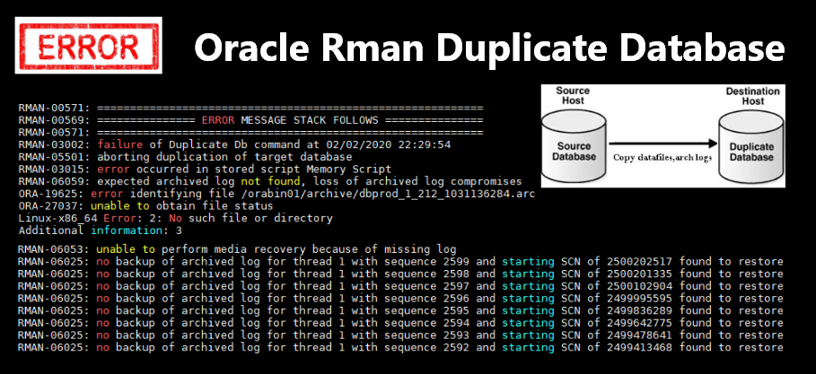

# Resolvendo ORA-19625 e ORA-06025 no Oracle Rman Duplicate Database (DBA)
##### Publicado em 06/02/2020 por [Michel Souza](https://www.linkedin.com/in/michel-ferreira-souza/)

<p style="text-align: justify">
Fala galera, quem nunca recebeu o erro ORA-19625 ou ORA-06025 realizando uma duplicação do banco de dados com Rman ? Já não basta a pressão do cliente para finalizar a clonagem de base e quando se menos esperar a carga finaliza com erro. 😱😱😞😞.

Antes de iniciar, agradeço meu amigo [José Laurindo Chiappa](https://www.linkedin.com/in/jlchiappa) por estar sempre me ajudando a evoluir. Obrigado por compartilhar seu conhecimento. Acompanhe o blog dele nesse [link](https://jlc1967.wordpress.com/)

Para resolver o problema, pode-se localizar onde estão os archivelog faltantes e aplica-los ou reiniciar a clonagem de base. Na segunda opção depedendo do tamanho do banco de dados é complicado falar para o cliente que vai ter que reiniciar, o mesmo já está pressionando para liberar o ambiente. <br>
Mas se não achar os archivelog não tem CHORORÔ, é iniciar a carga e ponto final, ou é possível fazer algumas manobras para contornar o problema, manobras essas que não é boa prática e nem será abordado neste artigo. 😎😎😎😎
</p>
 
> **Observação:** Neste artigo apresento como resolvo o erro ORA-19625 ou ORA-06025 em uma clonagem de base com duplicate, pode ser que o erro ORA-19625 seja obtido em outro cenário.

> *"A melhor forma de aprender é ensinando ou compartilhando conhecimento"*

## Problema   
Falando em clonagem de base utilizando Rman, o erro ORA-19625 ou ORA-06025 pode ser obtido da seguinte forma. Ao realizar a clonagem de base com ```Active Duplicate Database``` ou ```Duplicate From Bakup```, ocorreu que no momento do processo de duplicação do banco de dados, foi executado um backup de archivelog e no final do processo o script executou um **archivelog all delete input** ou nem todos os archivelog necessários para o recover foram copiados para o ambiente auxiliar, fazendo com que o erro no final do processo fosse gerado.

# Solução
Sempre que realizarmos um clonagem de base do tipo ```active duplicate database```, é importante que no decorrer desse processo não seja executado nenhum backup de archivelog ou se executado verifique se os archivelogs são multiplexados. <br>
Caso não, possivelmente o processo vai finalizar com erro se o archivelog forem consumidos por outro processo, como demonstrado no log abaixo. <br>

Veja o log completo [aqui](https://github.com/souzacristsf/article_database/blob/master/ORACLE/log/log.log_error_active_duplicate_arc.md). <br>
Log parcial do processo de clonagem de base no Rman.
```sql
contents of Memory Script:
{
   sql clone "alter system set  db_name =
 ''DBTESTE'' comment=
 ''Reset to original value by RMAN'' scope=spfile";
   sql clone "alter system reset  db_unique_name scope=spfile";
   shutdown clone immediate;
}
executing Memory Script

sql statement: alter system set  db_name =  ''DBTESTE'' comment= ''Reset to original value by RMAN'' scope=spfile

sql statement: alter system reset  db_unique_name scope=spfile

Oracle instance shut down
released channel: ch1
RMAN-00571: ===========================================================
RMAN-00569: =============== ERROR MESSAGE STACK FOLLOWS ===============
RMAN-00571: ===========================================================
RMAN-03002: failure of Duplicate Db command at 02/02/2020 22:29:54
RMAN-05501: aborting duplication of target database
RMAN-03015: error occurred in stored script Memory Script
RMAN-06059: expected archived log not found, loss of archived log compromises recoverability
ORA-19625: error identifying file /orabin01/archive/dbprod_1_212_1031136284.arc
ORA-27037: unable to obtain file status
Linux-x86_64 Error: 2: No such file or directory
Additional information: 3

RMAN>
```
Conforme o log apresentado acima, a clonagem de base finalizou com erro, devido o Rman não encontrar um archivelog no diretório ```/orabin01/archive/```. Esse erro ocorreu, pelo fato que o script de backup de archivelog executou no momento que a clonagem de base estava em andamento, deletando no final do processo todos archivelog gerado. 

Comando utilizado para a clonagem de base do tipo ```active duplicate database```. Veja neste artigo [Realizando um Active Database Duplication no mesmo servidor e solucionando os erros cometidos neste procedimento.](https://github.com/souzacristsf/article_database/blob/master/ORACLE/Duplicate/active_db_duplication.md)
```sql
run {
allocate channel ch1 type disk;
allocate auxiliary channel ch2 type disk;
SQL 'alter system switch logfile';
set newname for datafile 1 to '+DGDATA/dbteste/datafile/system01.dbf';
set newname for datafile 2 to '+DGDATA/dbteste/datafile/sysaux01.dbf';
set newname for datafile 3 to '+DGDATA/dbteste/datafile/undotbs01.dbf';
set newname for datafile 4 to '+DGDATA/dbteste/datafile/users01.dbf';
set newname for datafile 5 to '+DGDATA/dbteste/datafile/example.dbf';
set newname for datafile 6 to '+DGDATA/dbteste/datafile/data_teste01.dbf';
set newname for tempfile 1 to '+DGDATA/dbteste/datafile/temp01.dbf';
duplicate target database to dbteste from active database
SPFILE
    SET DB_NAME='dbteste'
    SET DB_UNIQUE_NAME='dbteste'
    SET CONTROL_FILES='+DGDATA'
    set SGA_TARGET='1024M'
    set PGA_AGGREGATE_TARGET='512M'
    SET DIAGNOSTIC_DEST='/orabin01/app/oracle'
    SET DB_FILE_NAME_CONVERT='+DGDATA/dbprod/datafile/','+DGDATA/dbteste/datafile/', '+DGDATA/dbprod/tempfile/','+DGDATA/dbteste/tempfile/'
    SET LOG_FILE_NAME_CONVERT='+DGRECO/dbprod/onlinelog/','+DGRECO/dbteste/onlinelog/'
    SET LOG_ARCHIVE_FORMAT='dbteste_%t_%s_%r.arc'
    set LOG_ARCHIVE_DEST='/orabin01/dbteste/archive/';
}
```

## Solucionando o problema e aplicando o archivelog faltante.
Para solucionar o problema e disponibilizar o ambiente DBTESTE, irei seguir as seguintes atividades: 
    
1) Iniciar a instância DBTESTE em ```nomount```;
2) Alterar o nome do parâmetro DB_NAME para **DBPROD** e abrir no estágio ```mount```;
3) Verificar quais datafiles precisam de recover, localizar os arquivelog faltantes e caso esteja nas peças de backup's realizar a extração dos mesmos;
4) Realizando o recover, aplicando o archivelog faltante;

Confirmado que o processo de clonagem de base finalizou com erro para a instância **DBTESTE**. Se tentarmos abrir o banco de dados, será obtido o seguinte erro abaixo.

## 1) Iniciar a instância DBTESTE em ```nomount```.

```sql
[oracle@lab ~]$ . oraenv <<< dbteste
ORACLE_SID = [dbprod] ? The Oracle base remains unchanged with value /orabin01/app/oracle
[oracle@lab ~]$ sqlplus / as sysdba

SQL*Plus: Release 11.2.0.4.0 Production on Mon Feb 3 20:47:48 2020

Copyright (c) 1982, 2013, Oracle.  All rights reserved.

Connected to an idle instance.

SQL> startup
ORACLE instance started.

Total System Global Area 1603411968 bytes
Fixed Size                  2253664 bytes
Variable Size             520096928 bytes
Database Buffers         1073741824 bytes
Redo Buffers                7319552 bytes
ORA-01103: database name 'DBPROD' in control file is not 'DBTESTE'

-- Verificando o status da instância auxiliar
INSTANCE_NAME    STATUS       VERSION           HOST_NAME			
---------------- ------------ ----------------- --------------------
dbteste          STARTED      11.2.0.4.0        lab.oracle.asm
```

Como mostra o erro ORA-01103, o nome do banco de dados no controlfile não corresponde com o nome do parâmetro db_name que está setado como **DBTESTE**, como mostra o resultado abaixo. <br>

Este problema foi ocasionado pelo erro na clonagem de base, pois no final do processo o controlfile é recriado pelo Rman com o mesmo nome do parâmetro db_name e isso não ocorreu pela falta dos archivelog.

Verificando o parâmentro db_name.
```sql
SQL> show parameter db_name

NAME         TYPE        VALUE		
-----------  ----------- ------------
db_name      string      DBTESTE
```

## 2) Alterar o nome do parâmetro DB_NAME para **DBPROD** e abrir a instância dbteste no estágio ```mount```.

É necessário alterar o parâmetro ```db_name``` para DBPROD, mesmo nome do ambiente *target*. 
> **Observação:** ao alterar o parâmetro db_name, verifique se o parâmetro db_unique_name não seja alterado também. Se alterar ao executar o comando ```startup mount```, receberá o seguinte erro **ORA-01102: cannot mount database in EXCLUSIVE mode**, esse erro ocorre pois já existe uma instância com o mesmo nome no mesmo servidor.

Alterando o parâmetro db_name, checando os parâmetros db_unique_name e db_name e abrindo no estágio mount.
```sql
SQL> ALTER SYSTEM SET DB_NAME=DBPROD SCOPE=SPFILE;    -- comando utilizado para alterar o db_name.

System altered.

SQL> show parameter name

NAME                                 TYPE        VALUE
------------------------------------ ----------- ------------------------------
db_name                              string      DBPROD
db_unique_name                       string      DBTESTE 
global_names                         boolean     FALSE
instance_name                        string      dbteste
service_names                        string      DBTESTE

SQL> alter database mount;

Database altered.

SQL>
```

## 3) Verificar quais datafiles precisam de recover, localizar os arquivelog faltantes e caso esteja nas peças de backup's realizar a extração dos mesmos.

```sql
col name form a50;
select file#, name, fuzzy, status, recover, CHECKPOINT_CHANGE#, checkpoint_time from v$datafile_header where fuzzy = 'YES';
SQL>
     FILE# NAME                                               FUZ STATUS  REC CHECKPOINT_CHANGE# CHECKPOINT_TIME
---------- -------------------------------------------------- --- ------- --- ------------------ -------------------
         1 +DGDATA/dbprod/datafile/system.256.1031136205      YES ONLINE                 1321045 04/02/2020 14:52:24
         2 +DGDATA/dbprod/datafile/sysaux.257.1031136207      YES ONLINE                 1321045 04/02/2020 14:52:24
         3 +DGDATA/dbprod/datafile/undotbs1.258.1031136207    YES ONLINE                 1321045 04/02/2020 14:52:24
         4 +DGDATA/dbprod/datafile/users.259.1031136207       YES ONLINE                 1321045 04/02/2020 14:52:24
         5 +DGDATA/dbprod/datafile/example.269.1031136307     YES ONLINE                 1321045 04/02/2020 14:52:24
         6 +DGDATA/dbprod/datafile/data_teste01.dbf           YES ONLINE                 1321045 04/02/2020 14:52:24
```

Conforme o resultado da consulta acima, se tentarmos recriar o controlfile e abrir o banco de dados, receberá o seguinte erro abaixo.
Esse erro ocorre pelo fato que é necessário aplicar mais archivelog até o atributo ```fuzzy``` da consulta acima não retornar nenhum datafile com valor **YES**.
> **Observação:** Caso necessário, pode-se colocar os datafiles que não fazem parte das tablespaces ````system``` e ````undotbs```` offline, mas os dados serão perdidos.
```sql
SQL> ALTER DATABASE OPEN RESETLOGS ;

ORA-01194: file 1 needs more recovery to be consistent
ORA-01110: data file 3: '+DGDATA/dbprod/datafile/system.256.1031136205'
```

Visto que não é possível abrir o banco com resetlogs, pelo fato que mais archivelogs deverão ser aplicados para garantir a consistência do mesmo. <br>
Será necessário verificar onde estão os archivelog faltantes para aplica-los, sabe-se que no momento da clonagem de base, do tipo ```active database duplication```, foi executado um backup de archivelog e acredita-se que os backup's ainda estão armazenados e não foram deletados com a retenção. 

Conforme o erro apresentado no log do Rman, sabe-se que a sequência do archivelog faltante é **212** e a thread# 1, visto que o mesmo é apresentado no nome do arquivo, como mostrado abaixo e o parâmentro **log_archive_format** pode-se verificar o formato do nome.

```sql
-- archivelog faltante 
ORA-19625: error identifying file /orabin01/archive/dbprod_1_212_1031136284.arc

-- formato do nome do archivelog no ambiente origem/target.
SQL> show parameter format

NAME                                 TYPE        VALUE
------------------------------------ ----------- ------------------------------
log_archive_format                   string      dbprod_%t_%s_%r.arc
```

Segue os passos abaixo para validar, verificar e localizar o archivelog no Rman. Cada comando está comentado para melhor entendimento do processo.

```sql
-- localizando a sequência 212, rman informa que não foi encontrado a sequência especificada no repositório.
RMAN> list archivelog sequence 212;

specification does not match any archived log in the repository     

-- veja um exemplo de uma sequência que existe no repositorio
RMAN> list archivelog sequence 217;

List of Archived Log Copies for database with db_unique_name DBPROD
=====================================================================

Key     Thrd Seq     S Low Time
------- ---- ------- - ---------
109     1    217     A 02-FEB-20
        Name: /orabin01/archive/dbprod_1_217_1031136284.arc   -- sequência encontrada.

-- realizando um crosscheck da sequencia 212, não foi encontrada
RMAN> CROSSCHECK ARCHIVELOG SEQUENCE 212;

released channel: ORA_DISK_1
allocated channel: ORA_DISK_1
channel ORA_DISK_1: SID=5 device type=DISK
specification does not match any archived log in the repository

-- realizando um crosscheck da sequencia 217, sequência encontrada e valida.
RMAN> CROSSCHECK ARCHIVELOG SEQUENCE 217;

released channel: ORA_DISK_1
allocated channel: ORA_DISK_1
channel ORA_DISK_1: SID=5 device type=DISK
validation succeeded for archived log
archived log file name=/orabin01/archive/dbprod_1_217_1031136284.arc RECID=109 STAMP=1031351412
Crosschecked 1 objects
```

Visto que o Rman validou que a sequência **212** não existe no repositório. É necessário localizar nas peças de backup's, conforme comando abaixo.

```sql
-- verificando se a sequência 212 foi backupeada. 
RMAN> list backup of archivelog sequence 212;

List of Backup Sets
===================

BS Key  Size       Device Type Elapsed Time Completion Time
------- ---------- ----------- ------------ ---------------
28      29.18M     DISK        00:00:05     02-FEB-20
        BP Key: 28   Status: AVAILABLE  Compressed: YES  Tag: BACKUPARCHIVELOGDIARIO
        Piece Name: /orabin01/backup/dbprod/fisico/files/arch_DBPROD_207_1_1031351375.arc

  List of Archived Logs in backup set 28
  Thrd Seq     Low SCN    Low Time  Next SCN   Next Time
  ---- ------- ---------- --------- ---------- ---------
  1    212     1264112    02-FEB-20 1264156    02-FEB-20

-- verificar se a peça de backup que contem o archivelog, se encontra disponivel.
RMAN> crosscheck backup of archivelog sequence 212;

using channel ORA_DISK_1
crosschecked backup piece: found to be 'AVAILABLE'
backup piece handle=/orabin01/backup/dbprod/fisico/files/arch_DBPROD_207_1_1031351375.arc RECID=28 STAMP=1031351375
Crosschecked 1 objects
```
Conforme resultado acima, o archivelog foi backupeado e está disponível, localizado no diretório ```/orabin01/backup/dbprod/fisico/files/```.

Extraindo o archivelog das peças de backup para um caminho especifico no filesystem.
O comando abaixo, localiza a sequência **212** e realiza a extração do archivelog do  backuppiece. 
```sql
RMAN> run {
set archivelog destination to '/orabin01/archive/dbteste';
restore archivelog sequence 212;
}2> 3> 4>

executing command: SET ARCHIVELOG DESTINATION
using target database control file instead of recovery catalog

Starting restore at 04-FEB-20
allocated channel: ORA_DISK_1
channel ORA_DISK_1: SID=5 device type=DISK

channel ORA_DISK_1: starting archived log restore to user-specified destination
archived log destination=/orabin01/archive/dbteste
channel ORA_DISK_1: restoring archived log
archived log thread=1 sequence=212
channel ORA_DISK_1: reading from backup piece /orabin01/backup/dbprod/fisico/files/arch_DBPROD_207_1_1031351375.arc
channel ORA_DISK_1: piece handle=/orabin01/backup/dbprod/fisico/files/arch_DBPROD_207_1_1031351375.arc tag=BACKUPARCHIVELOGDIARIO
channel ORA_DISK_1: restored backup piece 1
channel ORA_DISK_1: restore complete, elapsed time: 00:00:03
Finished restore at 04-FEB-20
```

## 4) Realizando o recover e aplicando o archivelog faltante

Sabe-se que a clonagem de base falhou, devido o Rman não identificar o archivelog com a sequência **212**. 
Mas como identificar quais os archivelog serão necessários para serem aplicados manualmente depois de uma falha? 🤔🤔🤔
Resposta: Pode-se verificar no log do Rman quais os archivelog foram listados para o recover, veja o log completo [aqui](https://github.com/souzacristsf/article_database/blob/master/ORACLE/log/log.log_error_active_duplicate_arc.md). <br>

Abaixo o log parcial do Rman duplicate, são listados os serguintes archivelog do target:
```sql
contents of Memory Script:
{
   backup as copy reuse
   archivelog like  "/orabin01/archive/dbprod_1_208_1031136284.arc" auxiliary format
 "+DGDATA"   archivelog like
 "/orabin01/archive/dbprod_1_212_1031136284.arc" auxiliary format
 "+DGDATA"   archivelog like
 "/orabin01/archive/dbprod_1_213_1031136284.arc" auxiliary format
 "+DGDATA"   archivelog like
 "/orabin01/archive/dbprod_1_215_1031136284.arc" auxiliary format
 "+DGDATA"   archivelog like
 "/orabin01/archive/dbprod_1_209_1031136284.arc" auxiliary format
 "+DGDATA"   archivelog like
 "/orabin01/archive/dbprod_1_214_1031136284.arc" auxiliary format
 "+DGDATA"   archivelog like
 "/orabin01/archive/dbprod_1_210_1031136284.arc" auxiliary format
 "+DGDATA"   archivelog like
 "/orabin01/archive/dbprod_1_211_1031136284.arc" auxiliary format
 "+DGDATA"   ;
   catalog clone start with  "+DGDATA";
   switch clone datafile all;
}
executing Memory Script

Starting backup at 02-FEB-20
```

No intuito de responder a pergunta acima, outra possibilidade é listar também quais foram os archivelog criados no ambiente target, depois que o duplicate foi realizado. Veja o exemplo abaixo:
```sql
Recovery Manager: Release 11.2.0.4.0 - Production on Sun Feb 2 22:26:02 2020  -- horário que o duplicate iniciou.

Copyright (c) 1982, 2011, Oracle and/or its affiliates.  All rights reserved.

connected to target database: DBPROD (DBID=1130215834)
connected to auxiliary database: DBTESTE (not mounted)
```

Conforme o log acima, pode-se utilizar o horário ```Sun Feb 2 22:26:02 2020``` do início do active duplicate para localizar quais os archivelog foram gerado depois desse horário. <br>
Transformando o horário em SCN no ambiente de origem/target.
```sql 
SQL> select timestamp_to_scn(to_timestamp('02/02/2020 22:26:02','DD/MM/YYYY HH24:MI:SS')) as scn from dual;

       SCN
----------
   1263125
   
```

No ambiente origem/target, pode-se utilizar o SCN para listar no RMAN os archivelog gerados depois do inicio da clonagem de base.
```sql
RMAN> list archivelog from scn 1263125;

using target database control file instead of recovery catalog
List of Archived Log Copies for database with db_unique_name DBPROD
=====================================================================

Key     Thrd Seq     S Low Time
------- ---- ------- - -------------------
174     1    212     A 02/02/2020 22:29:29 Name: /orabin01/archive/dbteste/dbprod_1_212_1031136284.arc
109     1    217     A 02/02/2020 22:29:52 Name: /orabin01/archive/dbprod_1_217_1031136284.arc
110     1    218     A 02/02/2020 22:30:12 Name: /orabin01/archive/dbprod_1_218_1031136284.arc
111     1    219     A 02/02/2020 22:30:30 Name: /orabin01/archive/dbprod_1_219_1031136284.arc
112     1    220     A 02/02/2020 22:30:48 Name: /orabin01/archive/dbprod_1_220_1031136284.arc
113     1    221     A 02/02/2020 22:31:04 Name: /orabin01/archive/dbprod_1_221_1031136284.arc
```

Ainda no ambiente origem/target, pode-se listar também os backup's de archivelog realizados depois do inicio da clonagem de base. Visto que as sequência de archivelog não existem mais no repositorio pagrão do archive.

```sql
RMAN> list backup of archivelog all completed after "to_date('02/02/2020 22:26:02','DD/MM/YYYY HH24:MI:SS')";

List of Backup Sets
===================

BS Key  Size       Device Type Elapsed Time Completion Time
------- ---------- ----------- ------------ -------------------
19      13.77M     DISK        00:00:03     02/02/2020 22:27:10
        BP Key: 19   Status: AVAILABLE  Compressed: YES  Tag: BACKUPARCHIVELOGDIARIO
        Piece Name: /orabin01/backup/dbprod/fisico/files/arch_DBPROD_192_1_1031351227.arc

  List of Archived Logs in backup set 19
  Thrd Seq     Low SCN    Low Time            Next SCN   Next Time
  ---- ------- ---------- ------------------- ---------- ---------
  1    197     1262977    02/02/2020 22:21:44 1263235    02/02/2020 22:27:02
  1    198     1263235    02/02/2020 22:27:02 1263345    02/02/2020 22:27:07

BS Key  Size       Device Type Elapsed Time Completion Time
------- ---------- ----------- ------------ -------------------
22      18.21M     DISK        00:00:03     02/02/2020 22:27:36
        BP Key: 22   Status: AVAILABLE  Compressed: YES  Tag: BACKUPARCHIVELOGDIARIO
        Piece Name: /orabin01/backup/dbprod/fisico/files/arch_DBPROD_196_1_1031351253.arc

  List of Archived Logs in backup set 22
  Thrd Seq     Low SCN    Low Time            Next SCN   Next Time
  ---- ------- ---------- ------------------- ---------- ---------
  1    199     1263345    02/02/2020 22:27:07 1263485    02/02/2020 22:27:27
  1    200     1263485    02/02/2020 22:27:27 1263538    02/02/2020 22:27:32

BS Key  Size       Device Type Elapsed Time Completion Time
------- ---------- ----------- ------------ -------------------
25      44.90M     DISK        00:00:07     02/02/2020 22:28:54
        BP Key: 25   Status: AVAILABLE  Compressed: YES  Tag: BACKUPARCHIVELOGDIARIO
        Piece Name: /orabin01/backup/dbprod/fisico/files/arch_DBPROD_201_1_1031351327.arc

  List of Archived Logs in backup set 25
  Thrd Seq     Low SCN    Low Time            Next SCN   Next Time
  ---- ------- ---------- ------------------- ---------- ---------
  1    201     1263538    02/02/2020 22:27:32 1263600    02/02/2020 22:27:41
  1    202     1263600    02/02/2020 22:27:41 1263705    02/02/2020 22:27:56
  1    203     1263705    02/02/2020 22:27:56 1263753    02/02/2020 22:28:11
  1    204     1263753    02/02/2020 22:28:11 1263806    02/02/2020 22:28:27
  1    205     1263806    02/02/2020 22:28:27 1263837    02/02/2020 22:28:30
  1    206     1263837    02/02/2020 22:28:30 1263871    02/02/2020 22:28:37
  1    207     1263871    02/02/2020 22:28:37 1263902    02/02/2020 22:28:45

BS Key  Size       Device Type Elapsed Time Completion Time
------- ---------- ----------- ------------ -------------------
28      29.18M     DISK        00:00:05     02/02/2020 22:29:40
        BP Key: 28   Status: AVAILABLE  Compressed: YES  Tag: BACKUPARCHIVELOGDIARIO
        Piece Name: /orabin01/backup/dbprod/fisico/files/arch_DBPROD_207_1_1031351375.arc

  List of Archived Logs in backup set 28
  Thrd Seq     Low SCN    Low Time            Next SCN   Next Time
  ---- ------- ---------- ------------------- ---------- ---------
  1    208     1263902    02/02/2020 22:28:45 1263911    02/02/2020 22:28:46
  1    209     1263911    02/02/2020 22:28:46 1263966    02/02/2020 22:28:59
  1    210     1263966    02/02/2020 22:28:59 1264047    02/02/2020 22:29:13
  1    211     1264047    02/02/2020 22:29:13 1264112    02/02/2020 22:29:29
  1    212     1264112    02/02/2020 22:29:29 1264156    02/02/2020 22:29:34

BS Key  Size       Device Type Elapsed Time Completion Time
------- ---------- ----------- ------------ -------------------
31      13.36M     DISK        00:00:03     02/02/2020 22:29:56
        BP Key: 31   Status: AVAILABLE  Compressed: YES  Tag: BACKUPARCHIVELOGDIARIO
        Piece Name: /orabin01/backup/dbprod/fisico/files/arch_DBPROD_211_1_1031351393.arc

  List of Archived Logs in backup set 31
  Thrd Seq     Low SCN    Low Time            Next SCN   Next Time
  ---- ------- ---------- ------------------- ---------- ---------
  1    213     1264156    02/02/2020 22:29:34 1264166    02/02/2020 22:29:35
  1    214     1264166    02/02/2020 22:29:35 1264184    02/02/2020 22:29:38
  1    215     1264184    02/02/2020 22:29:38 1264211    02/02/2020 22:29:41
  1    216     1264211    02/02/2020 22:29:41 1264333    02/02/2020 22:29:52
```

visto que os archivelog foram identificados nos resultados acima e estão ainda em disco. Será necessário realizar o comando **recover** abaixo no ambiente destino/auxiliar para verificar quais os archivelog serão solicitados para a recuperação.
```sql
SQL>  recover database using BACKUP CONTROLFILE until cancel;

ORA-00279: change 1263514 generated at 02/02/2020 22:27:27 needed for thread 1
ORA-00289: suggestion : +DGDATA
ORA-00280: change 1263514 for thread 1 is in sequence #200

Specify log: {<RET>=suggested | filename | AUTO | CANCEL}

ORA-00308: cannot open archived log '+DGDATA'
ORA-17503: ksfdopn:2 Failed to open file +DGDATA
ORA-15045: ASM file name '+DGDATA' is not in reference form

ORA-01547: warning: RECOVER succeeded but OPEN RESETLOGS would get error below
ORA-01194: file 1 needs more recovery to be consistent
ORA-01110: data file 1: '+DGDATA/dbprod/datafile/system.256.1031136205'
```

Veja que o resultado do comando ```recover database using BACKUP CONTROLFILE until cancel;``` acima, está solicitando o archivelog de sequência **200** que foi gerado as **02/02/2020 22:27:27**. Como já verificado nas etapas anteriores, essa sequência foi backupeada e é preciso extrair das peças de backup e mover para o diskgroup **+DGDATA** ou em outro local para a recuperação do banco.

Nota-se também, a informação que o datafiles que faz parte da tablespace system precisa de recover para ser consistente.

Utilizei novamente o comando abaixo para ir extrair todas as sequências apartir do 199 para serem utilizadas pelo comando ```recover``` e movendo para o ponto de montagem **/orabin01/archive/dbteste**.
```sql
run {
set archivelog destination to '/orabin01/archive/dbteste';
restore archivelog from sequence 199;
}2> 3> 4>

executing command: SET ARCHIVELOG DESTINATION
using target database control file instead of recovery catalog

Starting restore at 05-FEB-20

allocated channel: ORA_DISK_1
channel ORA_DISK_1: SID=369 device type=DISK
channel ORA_DISK_1: starting archived log restore to user-specified destination
archived log destination=/orabin01/archive/dbteste
channel ORA_DISK_1: restoring archived log
archived log thread=1 sequence=199
channel ORA_DISK_1: reading from backup piece /orabin01/backup/dbprod/fisico/files/arch_DBPROD_196_1_1031351253.arc
channel ORA_DISK_1: piece handle=/orabin01/backup/dbprod/fisico/files/arch_DBPROD_196_1_1031351253.arc tag=BACKUPARCHIVELOGDIARIO
channel ORA_DISK_1: restored backup piece 1
channel ORA_DISK_1: restore complete, elapsed time: 00:00:07
channel ORA_DISK_1: starting archived log restore to user-specified destination
archived log destination=/orabin01/archive/dbteste
channel ORA_DISK_1: restoring archived log
archived log thread=1 sequence=201
channel ORA_DISK_1: restoring archived log
archived log thread=1 sequence=202
channel ORA_DISK_1: restoring archived log
archived log thread=1 sequence=203
channel ORA_DISK_1: restoring archived log
archived log thread=1 sequence=204
channel ORA_DISK_1: restoring archived log
archived log thread=1 sequence=205
channel ORA_DISK_1: restoring archived log
archived log thread=1 sequence=206
channel ORA_DISK_1: restoring archived log
archived log thread=1 sequence=207
channel ORA_DISK_1: reading from backup piece /orabin01/backup/dbprod/fisico/files/arch_DBPROD_201_1_1031351327.arc
channel ORA_DISK_1: piece handle=/orabin01/backup/dbprod/fisico/files/arch_DBPROD_201_1_1031351327.arc tag=BACKUPARCHIVELOGDIARIO
channel ORA_DISK_1: restored backup piece 1
channel ORA_DISK_1: restore complete, elapsed time: 00:00:15
channel ORA_DISK_1: starting archived log restore to user-specified destination
archived log destination=/orabin01/archive/dbteste
channel ORA_DISK_1: restoring archived log
archived log thread=1 sequence=208
channel ORA_DISK_1: restoring archived log
archived log thread=1 sequence=209
channel ORA_DISK_1: restoring archived log
archived log thread=1 sequence=210
channel ORA_DISK_1: restoring archived log
archived log thread=1 sequence=211
channel ORA_DISK_1: reading from backup piece /orabin01/backup/dbprod/fisico/files/arch_DBPROD_207_1_1031351375.arc
channel ORA_DISK_1: piece handle=/orabin01/backup/dbprod/fisico/files/arch_DBPROD_207_1_1031351375.arc tag=BACKUPARCHIVELOGDIARIO
channel ORA_DISK_1: restored backup piece 1
channel ORA_DISK_1: restore complete, elapsed time: 00:00:07
channel ORA_DISK_1: starting archived log restore to user-specified destination
archived log destination=/orabin01/archive/dbteste
channel ORA_DISK_1: restoring archived log
archived log thread=1 sequence=213
channel ORA_DISK_1: restoring archived log
archived log thread=1 sequence=214
channel ORA_DISK_1: restoring archived log
archived log thread=1 sequence=215
channel ORA_DISK_1: restoring archived log
archived log thread=1 sequence=216
channel ORA_DISK_1: reading from backup piece /orabin01/backup/dbprod/fisico/files/arch_DBPROD_211_1_1031351393.arc
channel ORA_DISK_1: piece handle=/orabin01/backup/dbprod/fisico/files/arch_DBPROD_211_1_1031351393.arc tag=BACKUPARCHIVELOGDIARIO
channel ORA_DISK_1: restored backup piece 1
channel ORA_DISK_1: restore complete, elapsed time: 00:00:03
Finished restore at 05-FEB-20

```

Aplicando todos os archivelog solicitados, até o momento que é informado que não é mais necessário aplicar mais archivelog e o mesmo pode ser descartado.
```sql
SQL>  recover database using BACKUP CONTROLFILE until cancel;
ORA-00279: change 1263514 generated at 02/02/2020 22:27:27 needed for thread 1
ORA-00289: suggestion : +DGDATA
ORA-00280: change 1263514 for thread 1 is in sequence #200


Specify log: {<RET>=suggested | filename | AUTO | CANCEL}
/orabin01/archive/dbteste/dbprod_1_200_1031136284.arc
ORA-00279: change 1263538 generated at 02/02/2020 22:27:32 needed for thread 1
ORA-00289: suggestion : +DGDATA
ORA-00280: change 1263538 for thread 1 is in sequence #201


Specify log: {<RET>=suggested | filename | AUTO | CANCEL}
/orabin01/archive/dbteste/dbteste_1_201_1031136284.arc
ORA-00279: change 1263600 generated at 02/02/2020 22:27:41 needed for thread 1
ORA-00289: suggestion : +DGDATA
ORA-00280: change 1263600 for thread 1 is in sequence #202


Specify log: {<RET>=suggested | filename | AUTO | CANCEL}
/orabin01/archive/dbteste/dbprod_1_202_1031136284.arc
ORA-00279: change 1263705 generated at 02/02/2020 22:27:56 needed for thread 1
ORA-00289: suggestion : +DGDATA
ORA-00280: change 1263705 for thread 1 is in sequence #203


Specify log: {<RET>=suggested | filename | AUTO | CANCEL}
/orabin01/archive/dbteste/dbprod_1_203_1031136284.arc
ORA-00279: change 1263753 generated at 02/02/2020 22:28:11 needed for thread 1
ORA-00289: suggestion : +DGDATA
ORA-00280: change 1263753 for thread 1 is in sequence #204

....
....

Specify log: {<RET>=suggested | filename | AUTO | CANCEL}
/orabin01/archive/dbteste/dbprod_1_219_1031136284.arc
ORA-00279: change 1264548 generated at 02/02/2020 22:30:48 needed for thread 1
ORA-00289: suggestion : +DGDATA
ORA-00280: change 1264548 for thread 1 is in sequence #220
ORA-00278: log file '/orabin01/archive/dbprod_1_219_1031136284.arc' no longer
needed for this recovery  -- não é necessário aplicar mais archivelog.
```

Feito!!!

Se executarmos a consulta novamente para verificar quais datafiles precisam de recover, nenhum datafiles será listado, conforme consulta abaixo.

```sql
SQL> col name form a50;
select 
  file#
, name
, fuzzy
, status
, recover
, CHECKPOINT_CHANGE#
, checkpoint_time 
from v$datafile_header where fuzzy = 'YES';

no rows selected
```

> **Importante:** vale lembrar que toda atividade foi realizada em um ambiente de teste e não é uma boa prática manter apenas uma retenção de um backup, ou até mesmo apagar os archivelog's que não foram backupeado mais de 1 vez. Tenha uma política de retenção segura em seu ambiente. Realize a multiplexação dos archivelog. Uma retenção com **REDUNDANCY** de 2 ou 3 backup's completos. Tenha uma validação "auditoria" semanal dos backup's realizados. 

E é isso ai, depois de recuperar os archivelog manualmente, é necessário recriar o controlfile alterando o nome para instância auxiliar, no meu caso foi **dbteste** e abrir o banco de dados com **resetlogs**. Não vai precisar realizar uma nova clonagem de base por causa do erro ORA-19625. 😎😎😎😎 <br>

Apesar de não mostrar o erro ORA-06025, o processo para aplicação dos archivelog é o mesmo. Existem outras formas de se aplicar os archivelog.

E isso é tudo, espero que você esteja praticando também no seu ambiente de teste para aprendermos juntos. hahahaha

#FocoForçaFé

[Michel Souza](https://www.linkedin.com/in/michel-ferreira-souza/)

 ### Referências
[Oracle® Database Backup and Recovery Reference 11g Release 2 (11.2)](https://docs.oracle.com/html/E10643_07/rcmsynta020.htm)<br>
[Doc ID 1401333.1](https://support.oracle.com/epmos/faces/DocumentDisplay?_afrLoop=420730758818061&id=1401333.1&_afrWindowMode=0&_adf.ctrl-state=pkqb40dbh_4)<br>
[Doc ID 1439632.1](https://support.oracle.com/epmos/faces/DocumentDisplay?_afrLoop=420788224898243&parent=EXTERNAL_SEARCH&sourceId=PROBLEM&id=1439632.1&_afrWindowMode=0&_adf.ctrl-state=pkqb40dbh_53)<br>
[ALLOCATE CHANNEL](https://docs.oracle.com/html/E10643_07/rcmsynta004.htm)<br>
[RMAN-05001: Auxiliary Filename Conflicts with a File Used by the Target Database Tips](http://www.dba-oracle.com/t_rman_05001_auxiliary_filename_conflicts_with_file_used_by_target_database.htm)<br>
[Doc ID 334588.1](https://support.oracle.com/epmos/faces/DocumentDisplay?_afrLoop=420962633033303&parent=EXTERNAL_SEARCH&sourceId=PROBLEM&id=334588.1&_afrWindowMode=0&_adf.ctrl-state=pkqb40dbh_200)<br>
[Doc ID 1367794.1](https://support.oracle.com/epmos/faces/DocumentDisplay?_afrLoop=421003925587782&id=1367794.1&_adf.ctrl-state=pkqb40dbh_284)<br>
[RECOVER Guide and Reference](https://docs.oracle.com/cd/B19306_01/server.102/b14357/ch12033.htm)<br>
[recover [SQL*PLUS]](http://www.adp-gmbh.ch/ora/sqlplus/recover.html)<br>
[Perform Backup Based RMAN DUPLICATE Without Connecting To Target Database For Both Disk & Tape Backups (Doc ID 1375864.1)](https://support.oracle.com/epmos/faces/DocumentDisplay?_afrLoop=421174807174436&parent=EXTERNAL_SEARCH&sourceId=HOWTO&id=1375864.1&_afrWindowMode=0&_adf.ctrl-state=pkqb40dbh_391)<br>
[RMAN 11GR2 : DUPLICATE Without Target And Recovery Catalog Connection (Doc ID 874352.1)](https://support.oracle.com/epmos/faces/DocumentDisplay?_afrLoop=421198157557872&id=874352.1&_afrWindowMode=0&_adf.ctrl-state=pkqb40dbh_440)<br>