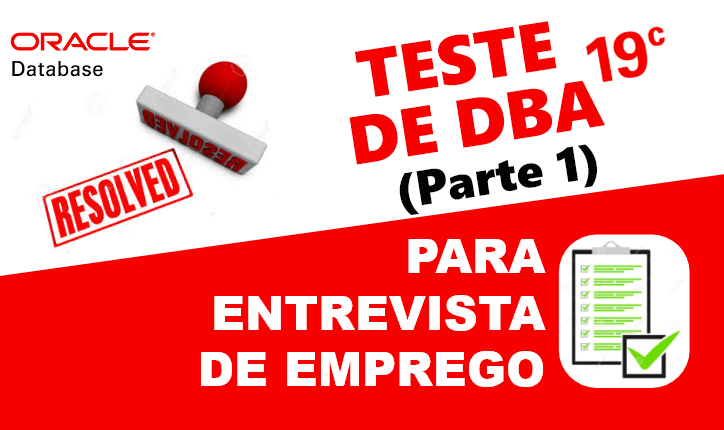
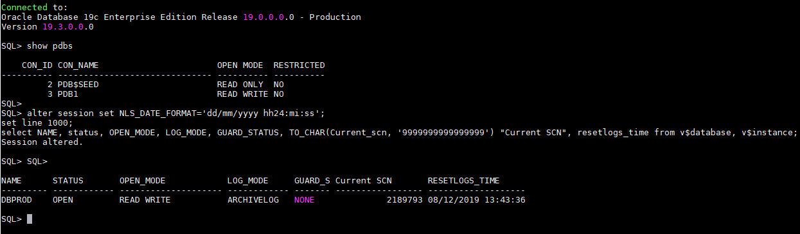

# Resolvendo teste para vaga de (DBA) - PARTE 1
##### Publicado em 08/12/2019 por [Michel Souza](https://www.linkedin.com/in/michel-ferreira-souza/)

<p style="text-align: justify">
Fala galera, neste post apresento a resolução de um teste para vaga de emprego de DBA. Quem vê <del>cara</del> currículo não vê <del>coração</del> habilidades práticas. Teste prático é uma ótima saída para identificar habilidade de resolver problema no menor tempo possível, sendo possível avaliar qual a solução encontrada e como o indivíduo se sai trabalhando sobre pressão. Existem momentos que não importa o tempo gasto e sim qual foi a solução encontrada. 
</p> 

> *"A melhor forma de aprender é ensinando ou compartilhando conhecimento"*

> **Observação**: o objetivo deste post não é apresentar o gabarito de um teste, mas sim compartilhar conhecimento, apresentando um pouco do dia a dia de um DBA e o que as empresas esperam inicialmente dos candidatos. 

# Requisitos para o teste
Para acompanhar o teste será necessário fazer os itens abaixo. 
1. criar um banco de dados ```dbprod```, caso já tenha um ambiente pule para o item 2. 
2. importar a base de dados da [IBM Cognos Analytics](https://www.ibm.com/support/knowledgecenter/en/SSEP7J_11.1.0/com.ibm.swg.ba.cognos.cbi.doc/welcome.html), leia a [documentação](https://www.ibm.com/support/knowledgecenter/en/SSEP7J_11.1.0/com.ibm.swg.ba.cognos.ig_smples.doc/c_asg_restore_scripts_oracle.html) para o restore da base de exemplo. Caso queira disponibilizei um dump [aqui](../DBSAMPLE/READE.md) é só baixar e importar, veja o log e res.

Segue o banco que utilizarei nesse teste como ambiente de produção. 

> **Observação:** Caso queira mesmo treinar, hehehehe. Crie um novo banco de dados antes de ir para as próximas sessões. O comando abaixo cria um Container Database (CDB) o mesma utilizada nesse post. Não esquece de altera as variavéis ```ORACLE_HOME e DATA_DIR```.
```bash
export ORACLE_HOME=/u01/app/oracle/product/19.3.0/dbhome_1
ORACLE_SID=dbprod
DB_NAME=dbprod
PDB_NAME=PDB1
DATA_DIR=/u01/oradata/${DB_NAME}

${ORACLE_HOME}/bin/dbca -silent -createDatabase					\
-templateName General_Purpose.dbc               \
-gdbname ${ORACLE_SID}                          \
-sid  ${ORACLE_SID}                             \
-responseFile NO_VALUE                          \
-characterSet AL32UTF8                          \
-sysPassword Manager19cPRD                      \
-systemPassword Manager19cPRD                   \
-createAsContainerDatabase true                 \
-numberOfPDBs 1                                 \
-pdbName ${PDB_NAME}                            \
-pdbAdminPassword Manager19cPRD                 \
-databaseType MULTIPURPOSE                      \
-automaticMemoryManagement false                \
-totalMemory 2048 -storageType FS               \
-datafileDestination "${DATA_DIR}"              \
-redoLogFileSize 150                            \
-emConfiguration NONE                           \
-initParams db_unique_name=${ORACLE_SID}, processes=300, log_archive_format=${ORACLE_SID}_%t_%r_%s.arc, db_name=${ORACLE_SID} \
-oratabLocation /etc/oratab
```

# Teste Prático DBA Oracle
Para realizar o teste o recrutador informa o acesso que normalmente é via SSH. Abaixo segue o ambiente utilizado para realizar o teste.

```
Sistema Operacional : Oracle Linux 7.6 64 Bits
Database Version    : Oracle Enterprise 19C
```
> **Observação**: o tempo para resolver o teste é de 2 horas. Faça o teste e tente reproduzir o mais próximo possível em seu ambiente de estudo.

> Sabe-se que não existe mais suporte para banco de dados em NON-CDB veja [aqui](https://docs.oracle.com/database/121/UPGRD/deprecated.htm#BABDBCJI), apenas para estudo o comando abaixo cria um banco de dados non-cdb.

  1. Crie um Non-CDB database com nome de DBTESTE on Group ASM "+DATA" ou filesystem local.
        <ol>
          <ul>1.1 Crie Non-CDB com os valores abaixo.
            <table>
              <tr>
                  <th>Requisito</th>
                  <th>Valor</th>
              </tr>
              <tr>
                  <td>CHARACTERSET</td>
                  <td>AL32UTF8</td>
              </tr>
              <tr>
                  <td>LANGUAGE</td>
                  <td>AMERICAN</td>
              </tr><tr>
                  <td>TERRITORY</td>
                  <td>AMERICA</td>
              </tr><tr>
                  <td>PASSWORD SYS</td>
                  <td>Manager19cTST</td>
              </tr>
              <tr>
                  <td>PASSWORD SYSTEM</td>
                  <td>Manager19cTST</td>
              </tr>
              <tr>
                  <td>MEMORY</td>
                  <td>ASMM</td>
              </tr>
            </table>
          </ul> <br>
          <ul>1.2 Multiplexar os Redolog criando 5 x 100 MB on Diskgroup "+DATA" ou filesystem local.
          </ul> <br>
          <ul>1.3 Crie uma Tablespace BIGFILE GOSALES_TS com 10 GB autoextend com 256M e extent management local autoallocate.</ul><br>
          <ul>1.4 Gerar um Dump FULL do PDB1 da instância ```dbprod``` e armazenar o dump no diretorio em '/u01/datapump/dbprod/FULL.PDB1.dmp'.</ul><br>
          <ul>1.5 Importe o Schema GOSALESDW e aplique todos os grants existentes na base origem.</ul><br>
          <ul>1.6 Colocar o banco em Modo Archivelog</ul><br>
          <ul>1.7 Execute um Backup RMAN Full da instância ```dbprod```.</ul><br>
          <ul>1.8 Importar a tabela EMP_RANKING_DIM com nome EMP_RANKING_DIM_BKP, no schema GOSALESDW em uma nova tablespace chamada TABLERECO.<ul>
        </ol>

2. Clone Database <br>
    2.1 Crie uma nova isntância DBTREINA a partir do RMAN FULL da base DBTESTE <br>
    2.2 Configure as áreas de Memória Manualmente


# Solução 
Resposta **1** e **1.1**) Uma das formas de criar um banco de dados Oracle é utilizando a interface gráfica DBCA. Como já foi criado um banco de produção ```dbprod``` na sessão anterior, vamos utilizar o mesmo comando para criar a base ```DBTESTE```.

Como esse teste tem o tempo de 2 horas para execução. Vamos utilizar o template **General_Purpose.dbc** para a criação do novo banco de dados.

Nesse [post](https://github.com/souzacristsf/article_database/blob/master/ORACLE/CREATEDB/silent.md) mostro como criar seu próprio template para a criação do banco de dados com o controlfile, redolog e achivelog multiplexados no momento da criação do banco.

Execute o comando abaixo para criar o banco de dados um novo banco de dados Non-CDB como se pede no teste.
```bash
export ORACLE_HOME=/u01/app/oracle/product/19.3.0/dbhome_1
ORACLE_SID=dbteste
DB_NAME=dbteste
DATA_DIR=/u01/oradata/${DB_NAME}
DB_UNIQUE_NAME=${DB_NAME}
DB_DOMAIN=localdomain
GLOBAL_DBNAME=${DB_NAME}.${DB_DOMAIN}
CHARSET=AL32UTF8
NATIONALCHARACTERSET=AL16UTF16
SYS_PWD=Manager19cTST
SYSTEM_PWD=Manager19cTST
REDO_SIZE_MB=100
COMPATIBLE=19.0.0

${ORACLE_HOME}/bin/dbca -silent -createDatabase \
  -templateName "General_Purpose.dbc" \
  -gdbName "${GLOBAL_DBNAME}" \
  -characterSet "${CHARSET}" \
  -createAsContainerDatabase "false" \
  -databaseConfigType SINGLE \
  -databaseType MULTIPURPOSE \
  -automaticMemoryManagement "false" \
  -totalMemory 2048 \
  -emConfiguration "NONE" \
  -nationalCharacterSet ${NATIONALCHARACTERSET} \
  -redoLogFileSize "${REDO_SIZE_MB}" \
  -sampleSchema "false" \
  -sid "${ORACLE_SID}" \
  -sysPassword "${SYS_PWD}" \
  -systemPassword "${SYSTEM_PWD}" \
  -useOMF "false" \
  -variablesFile /home/oracle/my_variable_dbca.txt \
  -initParams "compatible=${COMPATIBLE},db_domain=${DB_DOMAIN},db_name=${DB_NAME},db_unique_name=${DB_UNIQUE_NAME}" \
  -oratabLocation /etc/oratab
```
Resultado da criação do banco de dados ```dbteste```. 
```bash
Prepare for db operation
8% complete
Copying database files
31% complete
Creating and starting Oracle instance
32% complete
36% complete
40% complete
43% complete
46% complete
Completing Database Creation
51% complete
53% complete
54% complete
Creating Pluggable Databases
58% complete
77% complete
Executing Post Configuration Actions
100% complete
Database creation complete. For details check the logfiles at:
	/u01/app/oracle/cfgtoollogs/dbca/dbteste.
Database Information:
Global Database Name:dbteste
System Identifier(SID):dbteste
Look at the log file "/u01/app/oracle/cfgtoollogs/dbca/dbteste/dbteste.log" for further details.
```
**Muito bom!!!** já criamos o banco de dados, conforme se pede o teste, e no próximo post daremos continuidade nos outros itens. 

E isso é tudo, espero que você esteja acompanhando também no seu ambiente de teste para aprendermos juntos. hahahaha

Até o próximo artigo e vamos em frente!!!

#FocoForçaFé

[Michel Souza](https://www.linkedin.com/in/michel-ferreira-souza/)

 ### Referências
[Creating Templates for Oracle Database](https://docs.oracle.com/cd/E16447_01/doc/em.102/e14500/appdx_creating_db_templates.htm)