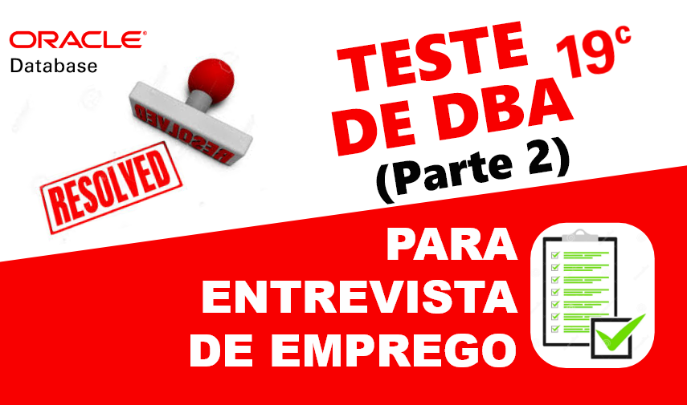
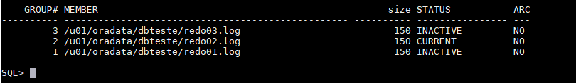
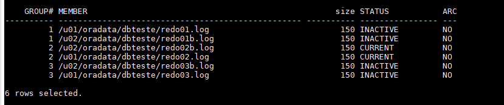
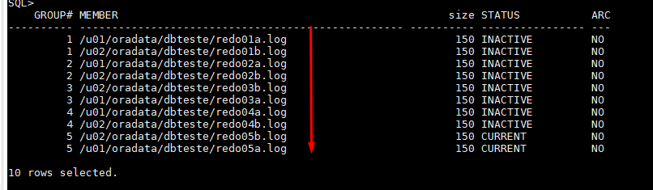
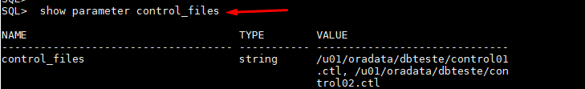

# Resolvendo teste para vaga de (DBA) - PARTE 2
##### Publicado em 24/12/2019 por [Michel Souza](https://www.linkedin.com/in/michel-ferreira-souza/)

Fala galera, continuando com a série aprendendo com **teste de DBA para entrevista de emprego**. Neste post darei continuidade da [Parte 1](https://github.com/souzacristsf/article_database/blob/master/ORACLE/TESTE_DBA/test_solved.md), apresentando a resolução de um teste para vaga de emprego de DBA. <br>
Quem vê <del>cara</del> currículo não vê <del>coração</del> habilidades práticas. Teste prático é uma ótima saída para identificar habilidade de resolver problema no menor tempo possível, sendo possível avaliar qual a solução encontrada e como o indivíduo se sai trabalhando sobre pressão. Existem momentos que não importa o tempo gasto e sim qual foi a solução encontrada. 

> *"A melhor forma de aprender é ensinando ou compartilhando conhecimento."*

> **Observação**: o objetivo deste post não é apresentar o gabarito de um teste, mas sim compartilhar conhecimento, apresentando um pouco do dia a dia de um DBA e o que as empresas esperam inicialmente dos candidatos.   

# Teste Prático DBA Oracle
Para realizar o teste o recrutador informa o acesso que normalmente é via SSH. Abaixo segue o ambiente utilizado para realizar o teste.

```
Sistema Operacional : Oracle Linux 7.6 64 Bits
Database Version    : Oracle Enterprise 19C
```
> **Observação**: o tempo para resolver o teste é de 2 horas. Faça o teste e tente reproduzir o mais próximo possível em seu ambiente de estudo. Não esqueça de documentar cada passo executado, isso é um ponto extra na apresentação da solução e para a vida de um DBA. hehehe

> Sabe-se que não existe mais suporte para banco de dados em NON-CDB veja [aqui](https://docs.oracle.com/database/121/UPGRD/deprecated.htm#BABDBCJI), apenas para estudo o comando abaixo cria um banco de dados non-cdb.

  1. Crie um Non-CDB database com nome de DBTESTE on Group ASM "+DATA" ou filesystem local.
        <ol>
          <ul>1.1 Crie Non-CDB com os valores abaixo. (Resolvido <a href="https://github.com/souzacristsf/article_database/blob/master/ORACLE/TESTE_DBA/test_solved.md">Parte - 1</a>).
            <table>
              <tr>
                  <th>Requisito</th>
                  <th>Valor</th>
              </tr>
              <tr>
                  <td>CHARACTERSET</td>
                  <td>AL32UTF8</td>
              </tr>
              <tr>
                  <td>LANGUAGE</td>
                  <td>AMERICAN</td>
              </tr><tr>
                  <td>TERRITORY</td>
                  <td>AMERICA</td>
              </tr><tr>
                  <td>PASSWORD SYS</td>
                  <td>Manager19cTST</td>
              </tr>
              <tr>
                  <td>PASSWORD SYSTEM</td>
                  <td>Manager19cTST</td>
              </tr>
              <tr>
                  <td>MEMORY</td>
                  <td>ASMM</td>
              </tr>
            </table>
          </ul> <br>
          <ul>1.2 Multiplexar os Redolog criando 3 x 100MB e controlfile on Diskgroup "+DATA" ou filesystem local.
          </ul> <br>
          <ul>1.3 Crie uma Tablespace BIGFILE GOSALES_TS com 10 GB autoextend com 256M e extent management local autoallocate.</ul><br>
          <ul>1.4 Gerar um Dump FULL do PDB1 da instância dbprod e armazenar o dump no diretorio em '/u01/datapump/dbprod/FULL.PDB1.dmp'.</ul><br>
          <ul>1.5 Importe o Schema GOSALESDW e aplique todos os grants existentes na base origem.</ul><br>
          <ul>1.6 Colocar o banco em Modo Archivelog</ul><br>
          <ul>1.7 Execute um Backup RMAN Full da instância dbprod.</ul><br>
          <ul>1.8 Importar a tabela EMP_RANKING_DIM com nome EMP_RANKING_DIM_BKP, no schema GOSALESDW em uma nova tablespace chamada GOSALES_TSRECO.<ul>
        </ol>

2. Clone Database <br>
    2.1 Crie uma nova isntância DBTREINA a partir do RMAN FULL da base DBTESTE <br>
    2.2 Configure as áreas de Memória Manualmente

# Solução 
### Multiplexando Redolog
Resposta **1.2**) Para multiplexar o redolog, primeiro verificamos quais os grupos e tamanho do redolog existente na instância **dbteste**. A consulta abaixo apresenta os grupos de redolog existentes na base.

```sql
column member format a50
select 
  a.group#
, a.member
, b.bytes/1024/1024 "size"
, b.STATUS
, ARCHIVED
from v$logfile a, v$log b  where a.group# = b.group#;
```
Na imagem abaixo, pode-se perceber que existem 3 grupos de redolog e cada grupo tem apenas 1 membro.

**Vamos multiplexar isso!!!** <br>
Primeiro, vamos adicionar mais 1 membro para cada grupo existente, pode-se utilizar o comando abaixo.

```sql
alter database add logfile member '/u02/oradata/dbteste/redo01b.log' to group 1; 
alter database add logfile member '/u02/oradata/dbteste/redo02b.log' to group 2; 
alter database add logfile member '/u02/oradata/dbteste/redo03b.log' to group 3; 
```
> **Observação**: A Oracle recomenda a multiplexação dos arquivos de redolog, a redundância em diferentes discos pode ajudar a proteger em uma eventual falha nos arquivos, erros de E/S ou corrupção de arquivos.  A perda dos dados do arquivo de log pode ser catastrófica se a recuperação for necessária, veja mais sobre o assunto nesse [link](https://docs.oracle.com/html/E25494_01/onlineredo002.htm). 

Realizando novamente a consulta, pode-se identificar que agora cada grupo tem dois membros de redolog em diferentes locais do filesystem. 


### Criando novos grupos de redolog <br>
O comando abaixo cria dois grupos de redolog com dois membros em cada grupo.
```sql
alter database add logfile group 4 (
'/u01/oradata/dbteste/redo04a.log',  
'/u02/oradata/dbteste/redo04b.log') size 150m reuse;

alter database add logfile group 5 (
'/u01/oradata/dbteste/redo05a.log',  
'/u02/oradata/dbteste/redo05b.log') size 150m reuse;
```
A imagem abaixo apresenta os grupos criados e até o momento os dois grupos estão com **status** UNUSED, pois ainda não foram utilizados.


### Removendo e recriando redolog <br>
Nota-se que ao criar uma banco de dados utilizando **DBCA** ou **silent mode**, por padrão são criados 3 grupos de redolog com apenas 1 membro cada. 
Para remover um grupo de redolog, utiliza-se o comando abaixo. 
```sql
alter database drop logfile group 2;
```

Para remover um membro do grupo de redolog, utiliza-se o seguinte comando. 
```sql
ALTER DATABASE DROP LOGFILE MEMBER '/u01/oradata/dbteste/redo02b.log';
```

Vale lembra que ao tentar **dropar** um grupo ou membro do redolog que esteja com status **CURRENT** no momento, tem-se os seguintes erros **ORA-01609** e **ORA-01623**, conforme imagem abaixo. <br>


Para forçar a troca do grupo de redolog para não obter o erro, pode-se utilizar o comando **ALTER SYSTEM SWITCH LOGFILE** ou **ALTER SYSTEM ARCHIVE LOG CURRENT**, os comandos fazem as mesmas ações mas de maneira diferente, entenda mais sobre o assunto [aqui](http://www.dba-oracle.com/t_alter_system_switch_logfile_vs_alter_system_archivelog_current.htm). <br>
Outro ponto importante é fazer com que as alteração do buffer de cada redo seja gravado em disco, utiliza-se o comando **alter system checkpoint** para forçar a gravação em disco . Feito isso o processo em segundo plano Oracle Checkpoint Process(CKPT) é responsável por escrever os pontos de verificação nos cabeçalhos dos arquivos de dados e nos arquivos de controle.

Depois de realizar a troca do redo com status *current* e *ativo*, pode-se proceguir com a normalizar dos redolog.


### Multiplexando Controlfile
Para realizar a multiplexação do controlfile, é necessário identificar quantos controlfile existem. A [Oracle](https://docs.oracle.com/cd/B10501_01/server.920/a96521/control.htm) recomenda a existência de no maximo 3 controlfile em discos diferentes, pois em caso de perda ou corrupção de algum controlfile é possivel restaurar o mesmo com os controlfile existentes ou do backup do controlfile.

Para verificar onde estão armazenados o controlfile, pode-se utilizar o comando abaixo.
```sql
show parameter control_files
```


Nota-se na imagem acima que existem apenas dois controlfile criados, irei adicionar mais um controlfile em um disco diferente, conforme o seguinte comando.
```sql
alter system set control_files='/u01/oradata/dbteste/control01.ctl','/u01/oradata/dbteste/control02.ctl','/u02/oradata/dbteste/control03.ctl' scope=spfile;
```
Visto que o parâmetro **control_files** não é dinâmico e sim estático, será necessário baixar o banco de dados com o comando **shut immediate** e subir no estágio nomount para a multiplexação do controlfile.

A consulta abaixo informa se o parâmetro modificado é dinâmico ou estático. Caso o retorno da consulta seja **IMMEDIATE** não é necessário reiniciar o banco de dados, se **false** é necessário fazer um restart da instância ou **DEFERRED** as alterações dos parâmetros passam a valer nas próximas sessões conectadas a instância. 
```sql
SQL> select ISSYS_MODIFIABLE from v$parameter where name like '%control_files%';

ISSYS_MOD
---------
FALSE
```

Realizado o **shut immediate** e **startup nomount** da instância DBTESTE, pode-se multiplexar o novo controlfile com um dos controlfile existentes utilizando RMAN, conforme o seguinte comando. 

```sql
RMAN> restore controlfile from '/u01/oradata/dbteste/control01.ctl';

Starting restore at 24/12/2019 01:12:16
using target database control file instead of recovery catalog
allocated channel: ORA_DISK_1
channel ORA_DISK_1: SID=38 device type=DISK

channel ORA_DISK_1: copied control file copy
output file name=/u01/oradata/dbteste/control01.ctl
output file name=/u01/oradata/dbteste/control02.ctl
output file name=/u02/oradata/dbteste/control03.ctl
Finished restore at 24/12/2019 01:12:21

RMAN> startup

database is already started
database mounted
released channel: ORA_DISK_1
database opened

RMAN>
```
Nota-se que o RMAN restaurou o controlfile realizando uma copia para os três destinos configurados no parâmetro *control_files* e na sequência foi possível subir a instância.
<br>
Se tentar subir a instância DBTESTE sem a existencia do controlfile **control03.ctl** setado no parâmetro *control_files*, obtêm-se o seguinte erro abaixo. 

```sql
SQL> startup
ORACLE instance started.

Total System Global Area 1610609200 bytes
Fixed Size                  8897072 bytes
Variable Size             385875968 bytes
Database Buffers         1207959552 bytes
Redo Buffers                7876608 bytes
ORA-00205: error in identifying control file, check alert log for more info

trace alert_dbteste.log
---------
2019-12-24T01:08:42.204167-04:00
ALTER DATABASE   MOUNT
2019-12-24T01:08:42.662246-04:00
ORA-00210: cannot open the specified control file
ORA-00202: control file: '/u02/oradata/dbteste/control03.ctl'
ORA-27037: unable to obtain file status
Linux-x86_64 Error: 2: No such file or directory
Additional information: 7
ORA-205 signalled during: ALTER DATABASE   MOUNT...
2019-12-24T01:08:42.914821-04:00
Errors in file /u01/app/oracle/diag/rdbms/dbteste/dbteste/trace/dbteste_mz00_5277.trc:
ORA-00202: control file: '/u02/oradata/dbteste/control03.ctl'
ORA-27037: unable to obtain file status
Linux-x86_64 Error: 2: No such file or directory
Additional information: 7
```

**Muito bom!!!** já criamos o banco de dados **DBTESTE** e realizamos a multiplexição do redolog e controlfile. Conforme se pede o teste, resolvemos o item **1.2** e no próximo post daremos continuidade nos outros itens. 

E isso é tudo, espero que você esteja praticando também no seu ambiente de teste para aprendermos juntos. hahahaha

Até o próximo artigo PARTE 3 e vamos em frente!!!

#FocoForçaFé

[Michel Souza](https://www.linkedin.com/in/michel-ferreira-souza/)

 