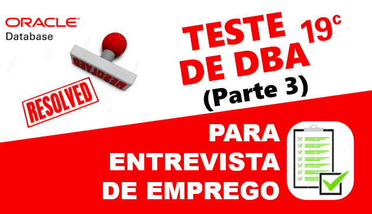

# Resolvendo teste para vaga de (DBA) - PARTE 3
##### Publicado em 31/12/2019 por [Michel Souza](https://www.linkedin.com/in/michel-ferreira-souza/)

Fala galera, continuando com a série aprendendo com **teste de DBA para entrevista de emprego**. Neste post darei continuidade da [Parte 2](https://github.com/souzacristsf/article_database/blob/master/ORACLE/TESTE_DBA/test_solved_parte-2.md), apresentando a resolução de um teste para vaga de emprego de DBA. <br> 

> *"A melhor forma de aprender é ensinando ou compartilhando conhecimento."*

> **Observação**: o objetivo deste post não é apresentar o gabarito de um teste, mas sim compartilhar conhecimento, apresentando um pouco do dia a dia de um DBA e o que as empresas esperam inicialmente dos candidatos.   

# Teste Prático DBA Oracle
Para realizar o teste o recrutador informa o acesso que normalmente é via SSH. Abaixo segue o ambiente utilizado para realizar o teste.

```
Sistema Operacional : Oracle Linux 7.6 64 Bits
Database Version    : Oracle Enterprise 19C
```
> **Observação**: o tempo para resolver o teste é de 2 horas. Faça o teste e tente reproduzir o mais próximo possível em seu ambiente de estudo. Não esqueça de documentar cada passo executado, isso é um ponto extra na apresentação da solução e para a vida de um DBA. hehehe

> Sabe-se que não existe mais suporte para banco de dados em NON-CDB veja [aqui](https://docs.oracle.com/database/121/UPGRD/deprecated.htm#BABDBCJI), apenas para estudo o comando abaixo cria um banco de dados non-cdb.

  1. Crie um Non-CDB database com nome de DBTESTE on Group ASM "+DATA" ou filesystem local.
        <ol>
          <ul>1.1 Crie Non-CDB com os valores abaixo. (Resolvido <a href="https://github.com/souzacristsf/article_database/blob/master/ORACLE/TESTE_DBA/test_solved.md">Parte - 1</a>).
            <table>
              <tr>
                  <th>Requisito</th>
                  <th>Valor</th>
              </tr>
              <tr>
                  <td>CHARACTERSET</td>
                  <td>AL32UTF8</td>
              </tr>
              <tr>
                  <td>LANGUAGE</td>
                  <td>AMERICAN</td>
              </tr><tr>
                  <td>TERRITORY</td>
                  <td>AMERICA</td>
              </tr><tr>
                  <td>PASSWORD SYS</td>
                  <td>Manager19cTST</td>
              </tr>
              <tr>
                  <td>PASSWORD SYSTEM</td>
                  <td>Manager19cTST</td>
              </tr>
              <tr>
                  <td>MEMORY</td>
                  <td>ASMM</td>
              </tr>
            </table>
          </ul> <br>
          <ul>1.2 Multiplexar os Redolog criando 3 x 100MB e controlfile on Diskgroup "+DATA" ou filesystem local. (Resolvido <a href="https://github.com/souzacristsf/article_database/blob/master/ORACLE/TESTE_DBA/test_solved_parte-2.md">Parte - 2</a>).
          </ul> <br>
          <ul>1.3 Crie uma Tablespace BIGFILE GOSALES_TS com 10 GB autoextend com 256M e extent management local autoallocate na instância DBTESTE.</ul><br>
          <ul>1.4 Gerar um Dump FULL do cdbprd da instância dbprod e armazenar o dump no diretorio em '/home/oracle/backup/logico/'.</ul><br>
          <ul>1.5 Importe o Schema GOSALESDW e aplique todos os grants existentes na base origem.</ul><br>
          <ul>1.6 Colocar o banco em Modo Archivelog</ul><br>
          <ul>1.7 Execute um Backup RMAN Full da instância dbprod.</ul><br>
          <ul>1.8 Importar a tabela EMP_RANKING_DIM com nome EMP_RANKING_DIM_BKP, no schema GOSALESDW em uma nova tablespace chamada GOSALES_TSRECO.<ul>
        </ol>

2. Clone Database <br>
    2.1 Crie uma nova isntância DBTREINA a partir do RMAN FULL da base DBTESTE <br>
    2.2 Configure as áreas de Memória Manualmente

# Solução 
## Criando tablespace BIGFILE
Resposta **1.3**) Sabe-se que o tipo padrão para a criação de tablespace na instância DBTESTE está como ```SMALLFILE```. 
No momento da criação do banco de dados por padrão é criado tablespace do tipo **SMALLFILE** para tablespace SYSTEM, SYSAUX e etc. 

Para a criação de uma nova tablespace, quando não informado o tipo no momento da criação por padrão é criado tablespace do tipo ```SMALLFILE```, exceto se o tipo padrão default for ```BIGFILE```. 
Para verificar qual o tipo padrão para criação de tablespace, utiliza-se o seguinte comando.
```sql
col PROPERTY_VALUE form a30;
SELECT PROPERTY_VALUE FROM DATABASE_PROPERTIES WHERE PROPERTY_NAME = 'DEFAULT_TBS_TYPE';

PROPERTY_VALUE
------------------------------
SMALLFILE
```
Visto que o valor padrão para criação de tablespace é smallfile. Para a criação da tablespace bigfile será necessário informar o **BIGFILE** no comando DDL, para isso utiliza-se o seguinte comando.
```sql
CREATE BIGFILE TABLESPACE "GOSALES_TS" DATAFILE '/u01/oradata/dbteste/gosales_data01.dbf' SIZE 10240M EXTENT MANAGEMENT LOCAL AUTOALLOCATE ;

alter database datafile '/u01/oradata/dbteste/gosales_data01.dbf' autoextend on next 256M;
```
Para verificar quais tablespaces são do tipo ```SMALLFILE``` ou ```BIGFILE```, utiliza-se o seguinte SELECT.
```sql
select tablespace_name, bigfile from dba_tablespaces;

TABLESPACE_NAME                BIG
------------------------------ -----------
SYSTEM                         SMALLFILE 
SYSAUX                         SMALLFILE
UNDOTBS1                       SMALLFILE
TEMP                           SMALLFILE
USERS                          SMALLFILE
GOSALES_TS                     BIGFILE

6 rows selected.
```

Caso queira alterar para **default bigfile**, pode-se utilizar o seguinte comando.
```sql
-- Set default tablespace bigfile
alter database set default bigfile tablespace;

-- Set default tablespace smallfile
alter database set default smallfile tablespace;
```
Quando o padrão for bigfile, pode-se omitir o **BIGFILE** do comando DDL, nesse caso utilizaríamos o seguinte comando para criar a tablespace bigfile **GOSALES_TS**.
```sql
CREATE TABLESPACE "GOSALES_TS" DATAFILE '+DATA/BDTESTE/DATAFILE/gosales_data01.dbf' SIZE 10240M EXTENT MANAGEMENT LOCAL AUTOALLOCATE ;
```
> **Observação**: Nota-se que criamos a tablespace ```GOSALES_TS``` sem a opção **FORCE LOGGING**. É necessario que qualquer alteração realizada na tablespace seja registrada no redolog sendo possível a recuperação das informações, veja [aqui](https://www.techonthenet.com/oracle/tablespaces/create_tablespace.php) todas as opções que contemplam a criação de tablespace.

Pode-se configurar ```FORCE LOGGING``` a nivél de banco de dados ou tablespace, veja mais informações [aqui](http://www.dba-oracle.com/t_oracledataguard_53_force_logging.htm).
Visto que é necessario o registro no redolog para recuperação, utiliza-se o seguinte select para identificar quais tablespace não estão habilitados o ```FORCE LOGGING```.
> **Observação**: Force Logging não tem efeito para tablespace temporária ou segmentos temporário pelo fato de não gerarem redo.
```sql
SQL> select 'ALTER TABLESPACE '||TABLESPACE_NAME||' FORCE LOGGING;' tbs from dba_tablespaces
where FORCE_LOGGING='NO' and CONTENTS='PERMANENT';  2

TBS
--------------------------------------------------------------
ALTER TABLESPACE USERS FORCE LOGGING; 
ALTER TABLESPACE GOSALES_TS FORCE LOGGING; -- habilita force loggin a nivel de tablespace.
```
Para verificar se o ```FORCE LOGGING``` está habilitado a nivél de banco, utiliza-se o comando abaixo.
```sql
select force_logging from v$database;

FORCE_LOGGING
---------------------------------------
NO    => não está habilitado force logging a nivel de banco.
```
Para habilitar o ```FORCE LOGGING``` a nivél de banco, usa-se o comando abaixo.
```sql
ALTER DATABASE FORCE LOGGING;

Database altered.

SQL> select force_logging from v$database;


FORCE_LOGGING
---------------------------------------
YES   => está habilitado force logging a nivel de banco.
```
Para desabilitar o ```FORCE LOGGING``` a nivél de banco, usa-se o comando abaixo.
```sql
ALTER DATABASE NO FORCE LOGGING;

Database altered.

SQL>  select force_logging from v$database;

FORCE_LOGGING
---------------------------------------
NO    => não está habilitado force logging a nivel de banco.
```
## Realizando um Dump Full do ambiente de produção CDBPRD
Resposta **1.4**) Antes de realizar o backup lógico é necessário realizar as seguintes atividades: 
+ Verificar qual o espaço em disco necessário para comportar as peças de backup.
+ Criar um **directory** para armazenar as peças de backup's,
+ Criar um usuário com as devidas permissões para realizar o backup
+ Conceder permissão ao usuário criado para leitura e escrita no **directory** criado para o expdp.
 
É necessário criar um usuário e senha na instância **dbprod** para ser utilizado no expdp, utiliza-se o seguinte comando.
```sql
SQL> show pdbs

    CON_ID CON_NAME                       OPEN MODE  RESTRICTED
---------- ------------------------------ ---------- ----------
         2 PDB$SEED                       READ ONLY  NO
         3 DBPROD                         READ WRITE
-- Alterar a sessão PDB.     
SQL> alter session set container=DBPROD;

Session altered.

SQL> create user testebkp identified by 12345;

User created.
```
Para criar um **directory** para apontar as peças de backup para serem armazenados, usa-se o seguinte comando. 
```sql
create or replace directory DUMP_DIR as '/home/oracle/backup/logico/';

Directory created.
```

Depois de criar o usuário e o directory, precisamos conceder as devidas permissões. 
```sql
-- granted for testebkp
grant connect, resource to testebkp;

Grant succeeded.

grant read,write on directory DUMP_DIR to testebkp;

Grant succeeded.

grant dba to testebkp;

Grant succeeded.
```
### Estimativa do tamanho do backup lógico
Para verificar quantos de espaço em disco precisamos para comportar as peças de backup lógico, utilizamos o seguinte comando do EXPDP. Com isso, utiliza-se o seguinte parâmetro **estimate_only** no expdp, responsável por calcular a estimativa do tamanho do backup.
```sql
-- utilizando easy connecta para o expdp
expdp testebkp/12345@dbprod FULL=y estimate_only=Y

Export: Release 19.0.0.0.0 - Production on Tue Dec 31 02:58:03 2019
Version 19.3.0.0.0

Copyright (c) 1982, 2019, Oracle and/or its affiliates.  All rights reserved.

Connected to: Oracle Database 19c Enterprise Edition Release 19.0.0.0.0 - Production
Starting "TESTEBKP"."SYS_EXPORT_FULL_01":  testebkp/********@dbprod FULL=y ESTIMATE_ONLY=y
Estimate in progress using BLOCKS method...
Processing object type DATABASE_EXPORT/EARLY_OPTIONS/VIEWS_AS_TABLES/TABLE_DATA
Processing object type DATABASE_EXPORT/NORMAL_OPTIONS/TABLE_DATA
Processing object type DATABASE_EXPORT/NORMAL_OPTIONS/VIEWS_AS_TABLES/TABLE_DATA
Processing object type DATABASE_EXPORT/SCHEMA/TABLE/TABLE_DATA
.  estimated "SYS"."KU$_USER_MAPPING_VIEW"                  16 KB
.  estimated "AUDSYS"."AUD$UNIFIED":"SYS_P221"             512 KB
.  estimated "GOSALESMR"."RETAILER_SURVEY_TOPIC"            64 KB
.  estimated "GOSALESRT"."ACTIVITY_STATUS_LOOKUP"           64 KB
.  estimated "GOSALESRT"."RETAILER_TYPE"                    64 KB
Total estimation using BLOCKS method: 210.4 MB
Job "TESTEBKP"."SYS_EXPORT_FULL_01" successfully completed at Tue Dec 31 02:59:40 2019 elapsed 0 00:01:22
```
Nota-se que a estimativa do tamanho do backup lógico é de 210.4 MB para exportar toda a base de dados.

Realizado a estimativa e verificado se o filesystem tem o espaço necessario para comportar o backup lógico da instância DBPROD, inicia-se o processo de exportação Full, conforme o camado abaixo.
> **Observação**: nota-se o uso do comando **nohup**, utilizado para executar processo em background.
```sql
nohup expdp userid=testebkp/12345@dbprod full=Y DIRECTORY=DUMP_DIR filesize=50M  DUMPFILE=DBPROD.FULL%U.`date +%Y%m%d%H`.dmp logfile=expdpDBPPROD.`date +%Y%m%d%H`.log &

-- log do expdp
Starting "TESTEBKP"."SYS_EXPORT_FULL_01":  userid=testebkp/********@dbprod full=Y DIRECTORY=DUMP_DIR filesize=50M DUMPFILE=DBPROD.FULL%U.2019123103.dmp logfile=expdpDBPPROD.2019123103.log
Processing object type DATABASE_EXPORT/EARLY_OPTIONS/VIEWS_AS_TABLES/TABLE_DATA
Processing object type DATABASE_EXPORT/NORMAL_OPTIONS/TABLE_DATA
. . exported "GOSALESDW"."BURST_TABLE2"                  6.429 KB       4 rows
. . exported "GOSALESDW"."BURST_TABLE"                   5.664 KB       3 rows
Master table "TESTEBKP"."SYS_EXPORT_FULL_01" successfully loaded/unloaded
******************************************************************************
Dump file set for TESTEBKP.SYS_EXPORT_FULL_01 is:
  /home/oracle/backup/logico/DBPROD.FULL01.2019123103.dmp
  /home/oracle/backup/logico/DBPROD.FULL02.2019123103.dmp
  /home/oracle/backup/logico/DBPROD.FULL03.2019123103.dmp
  /home/oracle/backup/logico/DBPROD.FULL04.2019123103.dmp
Job "TESTEBKP"."SYS_EXPORT_FULL_01" successfully completed at Tue Dec 31 03:37:39 2019 elapsed 0 00:11:29

```

**Muito bom!!!** neste artigo criamos um tablespace BIGFILE no ambiente **DBTESTE** e realizamos um DUMP FULL do ambiente de produção, resolvemos os itens **1.3** e **1.4** no próximo post daremos continuidade nos outros itens. 

E isso é tudo, espero que você esteja praticando também no seu ambiente de teste para aprendermos juntos. hahahaha

Até o próximo artigo PARTE 4 e vamos em frente!!!

#FocoForçaFé

[Michel Souza](https://www.linkedin.com/in/michel-ferreira-souza/)

 