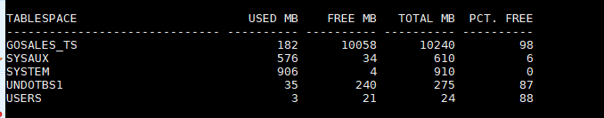

# Resolvendo teste para vaga de (DBA) - PARTE 4
##### Publicado em 12/01/2020 por [Michel Souza](https://www.linkedin.com/in/michel-ferreira-souza/)

Fala galera, continuando com a série aprendendo com **teste de DBA para entrevista de emprego**. Neste post darei continuidade da [Parte 3](https://github.com/souzacristsf/article_database/blob/master/ORACLE/TESTE_DBA/test_solved_parte-3.md), apresentando a resolução de um teste para vaga de emprego de DBA. <br> 

> *"A melhor forma de aprender é ensinando ou compartilhando conhecimento."* 

# Teste Prático DBA Oracle
Para realizar o teste o recrutador informa o acesso que normalmente é via SSH. Abaixo segue o ambiente utilizado para realizar o teste.

```
Sistema Operacional : Oracle Linux 7.6 64 Bits
Database Version    : Oracle Enterprise 19C
```

  1. Crie um Non-CDB database com nome de DBTESTE on Group ASM "+DATA" ou filesystem local.
        <ol>
          <ul>1.1 Crie Non-CDB com os valores abaixo. (Resolvido <a href="https://github.com/souzacristsf/article_database/blob/master/ORACLE/TESTE_DBA/test_solved.md">Parte - 1</a>).
            <table>
              <tr>
                  <th>Requisito</th>
                  <th>Valor</th>
              </tr>
              <tr>
                  <td>CHARACTERSET</td>
                  <td>AL32UTF8</td>
              </tr>
              <tr>
                  <td>LANGUAGE</td>
                  <td>AMERICAN</td>
              </tr><tr>
                  <td>TERRITORY</td>
                  <td>AMERICA</td>
              </tr><tr>
                  <td>PASSWORD SYS</td>
                  <td>Manager19cTST</td>
              </tr>
              <tr>
                  <td>PASSWORD SYSTEM</td>
                  <td>Manager19cTST</td>
              </tr>
              <tr>
                  <td>MEMORY</td>
                  <td>ASMM</td>
              </tr>
            </table>
          </ul> <br>
          <ul>1.2 Multiplexar os Redolog criando 3 x 100MB e controlfile on Diskgroup "+DATA" ou filesystem local. (Resolvido <a href="https://github.com/souzacristsf/article_database/blob/master/ORACLE/TESTE_DBA/test_solved_parte-2.md">Parte - 2</a>).
          </ul> <br>
          <ul>1.3 Crie uma Tablespace BIGFILE GOSALES_TS com 10 GB autoextend com 256M e extent management local autoallocate na instância DBTESTE.</ul> (Resolvido <a href="https://github.com/souzacristsf/article_database/blob/master/ORACLE/TESTE_DBA/test_solved_parte-3.md">Parte - 3</a>). <br> 
          <ul>1.4 Gerar um Dump FULL do cdbprd da instância dbprod e armazenar o dump no diretorio em '/home/oracle/backup/logico/'.</ul> (Resolvido <a href="https://github.com/souzacristsf/article_database/blob/master/ORACLE/TESTE_DBA/test_solved_parte-3.md">Parte - 3</a>).<br>
          <ul>1.5 Importe o Schema GOSALESDW e aplique todos os grants existentes na base origem.</ul><br>
          <ul>1.6 Colocar o banco em Modo Archivelog</ul><br>
          <ul>1.7 Execute um Backup RMAN Full da instância dbprod.</ul><br>
          <ul>1.8 Importar a tabela EMP_RANKING_DIM com nome EMP_RANKING_DIM_BKP, no schema GOSALESDW em uma nova tablespace chamada GOSALES_TSRECO.<ul>
        </ol>

2. Clone Database <br>
    2.1 Crie uma nova isntância DBTREINA a partir do RMAN FULL da base DBTESTE <br>
    2.2 Configure as áreas de Memória Manualmente

# Solução 
## Criando tablespace BIGFILE
Resposta **1.5**) Antes de iniciarmos a importação Schema **GOSALESDW** na instância DBTESTE, se atente primeiramente com as observações abaixo.
> **Observação**: Antes de qualquer carga ou restore verifique o tamanho que será ocupado em disco para que no meio do processo o mesmo não venha falhar.

Como iremos realizar uma carga logica, o comando abaixo verifica qual o tamanho do segmento do Schema **GOSALESDW** na instância de produção.
```sql
col owner form a20;
select owner, TABLESPACE_NAME, sum(bytes/1024/1024) MB from dba_segments where owner = 'GOSALESDW' group by owner, TABLESPACE_NAME order by owner;	

--result

OWNER                TABLESPACE_NAME      MB
-------------------- -------------------- ----------
GOSALESDW            GOSALES_TS           116.0625
```

Depois de verificar que o ambiente tem espaço em disco para tal atividade e que o procedimento de carga não vai afetar o ambiente produtivo, pelo fato que as instâncias estão no mesmo servidor e utilizando o mesmo disco, inicia-se o processo de carga da instância DBTESTE.

> **Observação**: visto que o diskgroup ou o filesystem nao supre o tamanho da dump a ser importado ou do restore, verifique com o responsável de infra para adicionar mais disco no ambiente.

### Criando um usuário para importação do Dump
Antes de importar os dados, vamos criar um usuário conforme o comando abaixo na base **DBTESTE**, conceder as permissões necessárias e criar um diretório para ser utilizado na importação.

```sql
SQL> create user teste identified by teste;

User created.
```
Concedendo privilégios e quota ao usuário ```teste```. 
```sql
SQL> grant connect, resource to teste;

Grant succeeded.

SQL> alter user teste quota unlimited on USERS;

User altered.

-- IMP_FULL_DATABASE permissão necessaria para realizar a importação do dados;
-- EXP_FULL_DATABASE permissão necessaria para realizar a exportação do dados;
SQL> grant  IMP_FULL_DATABASE to teste;

Grant succeeded.
```

Criando um diretório e concedendo permissão de leitura e escrita para o usuário ```teste```.
```sql
SQL> create or replace directory DATA_PUMP as '/home/oracle/backup/logico/';

Directory created.

SQL> grant read, write on directory DATA_PUMP to teste; 

Grant succeeded.
```

## Realizando a importação dos dados com IMPDP
Antes de realizar o import, vamos verificar qual o tamanho da tablespace **GOSALES_TS**, utilizando o comando abaixo.
```sql
SELECT
   DF.TABLESPACE_NAME                          "TABLESPACE",
   (DF.TOTALSPACE - FS.FREESPACE)              "USED MB",
   FS.FREESPACE                                "FREE MB",
   DF.TOTALSPACE                               "TOTAL MB",
   ROUND(100 * (FS.FREESPACE / DF.TOTALSPACE)) "PCT. FREE"
FROM
   (SELECT TABLESPACE_NAME, ROUND(SUM(BYTES) / 1048576) TOTALSPACE FROM DBA_DATA_FILES GROUP BY TABLESPACE_NAME) DF,
   (SELECT TABLESPACE_NAME, ROUND(SUM(BYTES) / 1048576) FREESPACE FROM DBA_FREE_SPACE GROUP BY TABLESPACE_NAME) FS
WHERE
   DF.TABLESPACE_NAME = FS.TABLESPACE_NAME(+)
   order by 1;	

--result

TABLESPACE         USED MB    FREE MB   TOTAL MB  PCT. FREE
--------------- ---------- ---------- ---------- ----------
GOSALES_TS              68      10172      10240         99
SYSAUX                 560         30        590          5
SYSTEM                 905          5        910          1
UNDOTBS1                35        240        275         87
USERS                    3          2          5         40
   
```

Iniciando a importação dos dados na base DBTESTE.

```sql
nohup impdp teste/teste@DBTESTE DIRECTORY=DATA_PUMP SCHEMAS=GOSALESDW DUMPFILE=DBPROD.FULL%U.2019123103.dmp logfile=impdpDBTESTE.GOSALESDW.`date +%Y%m%d%H`.log &

Import: Release 19.0.0.0.0 - Production on Sat Jan 11 22:09:48 2020
Version 19.3.0.0.0

Copyright (c) 1982, 2019, Oracle and/or its affiliates.  All rights reserved.

Connected to: Oracle Database 19c Enterprise Edition Release 19.0.0.0.0 - Production
Master table "TESTE"."SYS_IMPORT_SCHEMA_01" successfully loaded/unloaded
import done in AL32UTF8 character set and UTF8 NCHAR character set
export done in AL32UTF8 character set and AL16UTF16 NCHAR character set
Warning: possible data loss in character set conversions
Starting "TESTE"."SYS_IMPORT_SCHEMA_01":  teste/********@DBTESTE DIRECTORY=DATA_PUMP SCHEMAS=GOSALESDW DUMPFILE=DBPROD.FULL%U.2019123103.dmp logfile=impdpDBTESTE.GOSALESDW.2020011122.log
Processing object type DATABASE_EXPORT/SCHEMA/USER
Processing object type DATABASE_EXPORT/SCHEMA/GRANT/SYSTEM_GRANT
Processing object type DATABASE_EXPORT/SCHEMA/ROLE_GRANT
Processing object type DATABASE_EXPORT/SCHEMA/DEFAULT_ROLE
Processing object type DATABASE_EXPORT/SCHEMA/TABLESPACE_QUOTA
Processing object type DATABASE_EXPORT/SCHEMA/PROCACT_SCHEMA
Processing object type DATABASE_EXPORT/SCHEMA/TABLE/TABLE
Processing object type DATABASE_EXPORT/SCHEMA/TABLE/TABLE_DATA
. . imported "GOSALESDW"."SLS_SALES_FACT"                36.78 MB  446023 rows
. . imported "GOSALESDW"."SLS_SALES_ORDER_DIM"           9.776 MB  446023 rows
. . imported "GOSALESDW"."SLS_SALES_TARG_FACT"           8.569 MB  233625 rows
. . imported "GOSALESDW"."MRK_PRODUCT_SURVEY_FACT"       5.760 MB  165074 rows
. . imported "GOSALESDW"."FIN_FINANCE_FACT"              5.233 MB  164132 rows
. . imported "GOSALESDW"."EMP_EXPENSE_FACT"              4.918 MB  127984 rows
. . imported "GOSALESDW"."DIST_PRODUCT_FORECAST_FACT"    4.114 MB  129096 rows
. . imported "GOSALESDW"."DIST_INVENTORY_FACT"           2.379 MB   53837 rows
. . imported "GOSALESDW"."SLS_PRODUCT_LOOKUP"            2.134 MB    7946 rows
. . imported "GOSALESDW"."SLS_RTL_DIM"                   1.929 MB     847 rows
. . imported "GOSALESDW"."GO_TIME_DIM"                   1.218 MB    1465 rows
. . imported "GOSALESDW"."EMP_EXPENSE_PLAN_FACT"         1009. KB   30150 rows
. . imported "GOSALESDW"."EMP_EMPLOYEE_DIM"              804.3 KB     972 rows
. . imported "GOSALESDW"."EMP_SUMMARY_FACT"              916.2 KB   24233 rows
. . imported "GOSALESDW"."MRK_PROMOTION_FACT"            782.5 KB   11034 rows
. . imported "GOSALESDW"."MRK_RTL_SURVEY_FACT"           764.1 KB   22508 rows
. . imported "GOSALESDW"."DIST_RETURNED_ITEMS_FACT"      492.1 KB   10249 rows
. . imported "GOSALESDW"."MRK_PROMOTION_PLAN_FACT"       453.3 KB    8652 rows
. . imported "GOSALESDW"."FIN_ACCOUNT_NAME_LOOKUP"       425.8 KB     242 rows
. . imported "GOSALESDW"."EMP_POSITION_SUMMARY_FACT"     477.2 KB   15050 rows
. . imported "GOSALESDW"."BURST_TABLE"                   5.664 KB       3 rows
Processing object type DATABASE_EXPORT/SCHEMA/TABLE/STATISTICS/TABLE_STATISTICS
Processing object type DATABASE_EXPORT/STATISTICS/MARKER
Job "TESTE"."SYS_IMPORT_SCHEMA_01" successfully completed at Sat Jan 11 22:12:12 2020 elapsed 0 00:02:21
```
Como constatado no log da saída do import, nota-se que o Schema GOSALESDW foi importado com sucesso, vamos consultar novamente o tamanho da utilização da tablespace GOSALES_TS depois da importação.



```sql
col owner form a20;
select owner, TABLESPACE_NAME, sum(bytes/1024/1024) MB from dba_segments where owner = 'GOSALESDW' group by owner, TABLESPACE_NAME order by owner;	

--result

OWNER                TABLESPACE_NAME               MB
-------------------- --------------------- ----------
GOSALESDW            GOSALES_TS                114.25

```
Percebe-se na imagem acima que o tamanho utilizado da tablespace GOSALES_TS agora é 182MB.


## Habilitando o modo archivelog na instância DBTESTE
Resposta **1.6**) Vamos checar se o modo archive está habilitado ou desabilitado no banco utilizando o comando abaixo.
```sql
SQL> archive log list
Database log mode              No Archive Mode
Automatic archival             Disabled
Archive destination            /u01/app/oracle/product/19.3.0.0/dbhome_1/dbs/arch
Oldest online log sequence     14
Current log sequence           18
```
Note-se com o resultado acima que está desabilitado a geração dos archivelog e ainda o destino do mesmo está apontando para o ```$ORACLE_HOME/dbs/arch```, vamos alterar o destino dos archivelog e habilitar.
> **Observação**: archivelog é criado pelo banco de dados nas operações de transações, como: Insert, Drop, Alter, entre outros. Esses archivelog's são utilizados para recuperar as informações do banco de dados.

> **Observação**: antes de alterar o banco para ```Archive Mode``` é necessário verificar onde ficará armazenado os archivelog no disco local ou ASM.

```sql
-- antes de alterar os parametros do sistema, vamos salvar o pfile.
SQL> create pfile='/tmp/pfileDBTESTE.txt' from spfile;

File created.

-- alterando o formato ou nome do arquivo dos archivelog.
SQL> alter system set log_archive_format='DBTESTE%t_%s_%r.arc' scope=spfile;

System altered.

-- alterando o destino dos archivelog.
SQL> alter system set log_archive_dest_1='LOCATION=/u02/archivelog/dbteste' scope=spfile;

System altered.


-- baixando a instância DBTESTE.
SQL> shut immediate;
Database closed.
Database dismounted.
ORACLE instance shut down.
```

> **Observação**: caso seja necessário multiplexar os archivelog, verifique e altere o parâmetro ```log_archive_min_succeed_dest```,  define o número mínimo de destinos que devem ser bem-sucedidos para que o archivelog online esteja disponível para reutilização.  

Depois de alterar os parâmetros necessários e baixar a instância DBTESTE, temos que iniciar a instância em ```mount```.
```sql 
-- iniciando a instância DBTESTE em mount 
SQL> startup mount
ORACLE instance started.

Total System Global Area 1610609200 bytes
Fixed Size                  8897072 bytes
Variable Size             452984832 bytes
Database Buffers         1140850688 bytes
Redo Buffers                7876608 bytes
Database mounted.
```
Habilitando o modo archivelog.
```sql 
SQL> alter database archivelog;

Database altered.
```

Abrindo o banco de dados e verificando se está habilitado o modo archivelog.
```sql 
SQL> alter database open;

Database altered.

SQL> archive log list
Database log mode              Archive Mode
Automatic archival             Enabled
Archive destination            /u02/archivelog/dbteste
Oldest online log sequence     14
Next log sequence to archive   18
Current log sequence           18
```

Gerando archivelog no destino parametrizado.
```sql
SQL> alter system switch logfile;

System altered.

SQL> alter system checkpoint;

System altered.

```
Verificando se os archivelog estão sendo no destino

```bash
ls -ltrh /u02/archivelog/dbteste
total 43M
-rw-r-----. 1 oracle oinstall  43M Jan 11 23:28 DBTESTE1_18_1027593916.arc
-rw-r-----. 1 oracle oinstall  21K Jan 11 23:33 DBTESTE1_19_1027593916.arc
-rw-r-----. 1 oracle oinstall 1.0K Jan 11 23:33 DBTESTE1_20_1027593916.arc
```
### Realizando um backup físico da instância de produção com RMAN
Resposta **1.7**) Para realizar um backup full, vamos criar um script ```shell``` e salvar em um destino (meu destino ```/u02/script/BkpRmanFull.sh```) para executar esse script de backup como processo background.

Conteúdo do script *BkpRmanFull.sh*:<br>
**obs: substitua as variaveis de acordo com seu ambiente.**
```bash
#!/bin/ksh

# Conf Backup
export ORACLE_BASE=/u01/app/oracle
export ORACLE_HOME=$ORACLE_BASE/product/19.3.0.0/dbhome_1
export PATH=/usr/sbin:$PATH:/sbin:$ORACLE_HOME/bin
export ORACLE_SID=cdbprd
export DIR_BASE=/u02/backup/${ORACLE_SID}/fisico 
# Destino do log do backup
export DIR_LOG=$DIR_BASE/logs
# Destino das peças de backup
export DIR_BKP=$DIR_BASE/files
# Arquivo de log do backup 
export ARQ_LOG=$DIR_LOG/BackupFull_${ORACLE_SID}_`date '+%d%m%Y_%H%M'`.log

#rman target / <<EOF 1>> ${ARQ_LOG} 2>> ${ARQ_LOG}

echo "`date` => Inicio do backup rman ..." >> $ARQ_LOG
rman target / <<EOF 1>> ${ARQ_LOG} 2>> ${ARQ_LOG}
show all;
run {
allocate channel d1 type disk FORMAT '${DIR_BKP}/df_%d_%s_%p_%t.dbf' maxpiecesize 10000M;
backup as compressed backupset tag 'BkpDBFull' database;
release channel d1;
sql 'alter system archive log current';
allocate channel d2 type disk FORMAT '${DIR_BKP}/arch_%d_%s_%p_%t.arc' maxpiecesize 5000M;
backup as compressed backupset tag 'BkpArchive' archivelog all delete all input;
release channel d2;
allocate channel d3 type disk FORMAT '${DIR_BKP}/cf_%d_%s_%p_%t.ctl' maxpiecesize 1000M;
backup as compressed backupset tag 'BkpCurrentCTL' current controlfile;
release channel d3;
allocate channel d4 type disk FORMAT '${DIR_BKP}/sp_%d_%s_%p_%t.ora';
backup as compressed backupset tag 'BkpCurrentSPFile' spfile;
release channel d4;
}
exit
EOF
```
> **Observação**: lembre-se que para iniciar um ```Hot Backup (On-Line)```, é necessário que o banco esteja em modo archivelog habilitado. Para realizar um ```Cold Backup (Offline)```, é ncessário que o banco esteja no estagio ```mount```.

Iniciando o processo de backup em background com o comando abaixo.
```bash
# executando o script de backup full em background.
nohup sh /u02/script/BkpRmanFull.sh &

# verificando o log do backup full, temos as seguintes informações
[oracle@lab-ol8-19c => (cdbprd) logs]$ tail -2000f BackupFull_cdbprd_12012020_0027.log
Sun Jan 12 00:27:02 -04 2020 => Inicio do backup rman ...

Recovery Manager: Release 19.0.0.0.0 - Production on Sun Jan 12 00:27:02 2020
Version 19.3.0.0.0

Copyright (c) 1982, 2019, Oracle and/or its affiliates.  All rights reserved.

connected to target database: CDBPRD (DBID=1047786992)

RMAN>
using target database control file instead of recovery catalog
RMAN configuration parameters for database with db_unique_name CDBPRD are:
CONFIGURE RETENTION POLICY TO REDUNDANCY 1; # default
CONFIGURE BACKUP OPTIMIZATION OFF; # default
CONFIGURE DEFAULT DEVICE TYPE TO DISK; # default
CONFIGURE CONTROLFILE AUTOBACKUP ON; # default
CONFIGURE CONTROLFILE AUTOBACKUP FORMAT FOR DEVICE TYPE DISK TO '%F'; # default
CONFIGURE DEVICE TYPE DISK PARALLELISM 1 BACKUP TYPE TO BACKUPSET; # default
CONFIGURE DATAFILE BACKUP COPIES FOR DEVICE TYPE DISK TO 1; # default
CONFIGURE ARCHIVELOG BACKUP COPIES FOR DEVICE TYPE DISK TO 1; # default
CONFIGURE MAXSETSIZE TO UNLIMITED; # default
CONFIGURE ENCRYPTION FOR DATABASE OFF; # default
CONFIGURE ENCRYPTION ALGORITHM 'AES128'; # default
CONFIGURE COMPRESSION ALGORITHM 'BASIC' AS OF RELEASE 'DEFAULT' OPTIMIZE FOR LOAD TRUE ; # default
CONFIGURE RMAN OUTPUT TO KEEP FOR 7 DAYS; # default
CONFIGURE ARCHIVELOG DELETION POLICY TO NONE; # default
CONFIGURE SNAPSHOT CONTROLFILE NAME TO '/u01/app/oracle/product/19.3.0.0/dbhome_1/dbs/snapcf_cdbprd.f'; # default

RMAN> 2> 3> 4> 5> 6> 7> 8> 9> 10> 11> 12> 13> 14> 15>
allocated channel: d1
channel d1: SID=74 device type=DISK

Starting backup at 12/01/2020 00:27:11
channel d1: starting compressed full datafile backup set
channel d1: specifying datafile(s) in backup set
input datafile file number=00001 name=/u01/oradata/cdbprd/system01.dbf
input datafile file number=00003 name=/u01/oradata/cdbprd/sysaux01.dbf
input datafile file number=00004 name=/u01/oradata/cdbprd/undotbs01.dbf
input datafile file number=00007 name=/u01/oradata/cdbprd/users01.dbf
channel d1: starting piece 1 at 12/01/2020 00:27:12
channel d1: finished piece 1 at 12/01/2020 00:30:27
piece handle=/u02/backup/cdbprd/fisico/files/df_CDBPRD_13_1_1029457631.dbf tag=BKPDBFULL comment=NONE
channel d1: backup set complete, elapsed time: 00:03:15
channel d1: starting compressed full datafile backup set
channel d1: specifying datafile(s) in backup set
input datafile file number=00013 name=/u01/app/oracle/product/19.3.0.0/dbhome_1/dbs/GOSALES_TS.ora
input datafile file number=00010 name=/u01/oradata/cdbprd/dbprod/sysaux01.dbf
input datafile file number=00009 name=/u01/oradata/cdbprd/dbprod/system01.dbf
input datafile file number=00011 name=/u01/oradata/cdbprd/dbprod/undotbs01.dbf
input datafile file number=00012 name=/u01/oradata/cdbprd/dbprod/users01.dbf
channel d1: starting piece 1 at 12/01/2020 00:30:28
channel d1: finished piece 1 at 12/01/2020 00:32:03
piece handle=/u02/backup/cdbprd/fisico/files/df_CDBPRD_14_1_1029457828.dbf tag=BKPDBFULL comment=NONE
channel d1: backup set complete, elapsed time: 00:01:35
channel d1: starting compressed full datafile backup set
channel d1: specifying datafile(s) in backup set
input datafile file number=00006 name=/u01/oradata/cdbprd/pdbseed/sysaux01.dbf
input datafile file number=00005 name=/u01/oradata/cdbprd/pdbseed/system01.dbf
input datafile file number=00008 name=/u01/oradata/cdbprd/pdbseed/undotbs01.dbf
channel d1: starting piece 1 at 12/01/2020 00:32:04
channel d1: finished piece 1 at 12/01/2020 00:33:29
piece handle=/u02/backup/cdbprd/fisico/files/df_CDBPRD_15_1_1029457924.dbf tag=BKPDBFULL comment=NONE
channel d1: backup set complete, elapsed time: 00:01:25
Finished backup at 12/01/2020 00:33:29

Starting Control File and SPFILE Autobackup at 12/01/2020 00:33:30
piece handle=/u01/app/oracle/product/19.3.0.0/dbhome_1/dbs/c-1047786992-20200112-00 comment=NONE
Finished Control File and SPFILE Autobackup at 12/01/2020 00:33:38

released channel: d1

sql statement: alter system archive log current

allocated channel: d3
channel d3: SID=74 device type=DISK

Starting backup at 12/01/2020 00:33:41
current log archived
channel d3: starting compressed archived log backup set
channel d3: specifying archived log(s) in backup set
input archived log thread=1 sequence=17 RECID=1 STAMP=1029457135
input archived log thread=1 sequence=18 RECID=2 STAMP=1029457143
input archived log thread=1 sequence=19 RECID=3 STAMP=1029457148
input archived log thread=1 sequence=20 RECID=4 STAMP=1029457151
input archived log thread=1 sequence=21 RECID=5 STAMP=1029457504
input archived log thread=1 sequence=22 RECID=6 STAMP=1029457510
input archived log thread=1 sequence=23 RECID=7 STAMP=1029457525
input archived log thread=1 sequence=24 RECID=8 STAMP=1029458020
input archived log thread=1 sequence=25 RECID=9 STAMP=1029458021
channel d3: starting piece 1 at 12/01/2020 00:33:42
channel d3: finished piece 1 at 12/01/2020 00:33:49
piece handle=/u02/backup/cdbprd/fisico/files/arch_CDBPRD_17_1_1029458022.arc tag=BKPARCHIVE comment=NONE
channel d3: backup set complete, elapsed time: 00:00:07
channel d3: deleting archived log(s)
archived log file name=/u02/archivelog/dbprod/DBPROD1_17_1027590646.arc RECID=1 STAMP=1029457135
archived log file name=/u02/archivelog/dbprod/DBPROD1_18_1027590646.arc RECID=2 STAMP=1029457143
archived log file name=/u02/archivelog/dbprod/DBPROD1_19_1027590646.arc RECID=3 STAMP=1029457148
archived log file name=/u02/archivelog/dbprod/DBPROD1_20_1027590646.arc RECID=4 STAMP=1029457151
archived log file name=/u02/archivelog/dbprod/DBPROD1_21_1027590646.arc RECID=5 STAMP=1029457504
archived log file name=/u02/archivelog/dbprod/DBPROD1_22_1027590646.arc RECID=6 STAMP=1029457510
archived log file name=/u02/archivelog/dbprod/DBPROD1_23_1027590646.arc RECID=7 STAMP=1029457525
archived log file name=/u02/archivelog/dbprod/DBPROD1_24_1027590646.arc RECID=8 STAMP=1029458020
archived log file name=/u02/archivelog/dbprod/DBPROD1_25_1027590646.arc RECID=9 STAMP=1029458021
Finished backup at 12/01/2020 00:33:51

Starting Control File and SPFILE Autobackup at 12/01/2020 00:33:51
piece handle=/u01/app/oracle/product/19.3.0.0/dbhome_1/dbs/c-1047786992-20200112-01 comment=NONE
Finished Control File and SPFILE Autobackup at 12/01/2020 00:33:54

released channel: d3

allocated channel: d2
channel d2: SID=74 device type=DISK

Starting backup at 12/01/2020 00:33:55
channel d2: starting compressed full datafile backup set
channel d2: specifying datafile(s) in backup set
including current control file in backup set
channel d2: starting piece 1 at 12/01/2020 00:33:57
channel d2: finished piece 1 at 12/01/2020 00:33:58
piece handle=/u02/backup/cdbprd/fisico/files/cf_CDBPRD_19_1_1029458036.ctl tag=BKPCURRENTCTL comment=NONE
channel d2: backup set complete, elapsed time: 00:00:01
Finished backup at 12/01/2020 00:33:58

Starting Control File and SPFILE Autobackup at 12/01/2020 00:33:58
piece handle=/u01/app/oracle/product/19.3.0.0/dbhome_1/dbs/c-1047786992-20200112-02 comment=NONE
Finished Control File and SPFILE Autobackup at 12/01/2020 00:34:01

released channel: d2

allocated channel: d4
channel d4: SID=74 device type=DISK

Starting backup at 12/01/2020 00:34:03
channel d4: starting compressed full datafile backup set
channel d4: specifying datafile(s) in backup set
including current SPFILE in backup set
channel d4: starting piece 1 at 12/01/2020 00:34:04
channel d4: finished piece 1 at 12/01/2020 00:34:05
piece handle=/u02/backup/cdbprd/fisico/files/sp_CDBPRD_21_1_1029458044.ora tag=BKPCURRENTSPFILE comment=NONE
channel d4: backup set complete, elapsed time: 00:00:01
Finished backup at 12/01/2020 00:34:05

Starting Control File and SPFILE Autobackup at 12/01/2020 00:34:05
piece handle=/u01/app/oracle/product/19.3.0.0/dbhome_1/dbs/c-1047786992-20200112-03 comment=NONE
Finished Control File and SPFILE Autobackup at 12/01/2020 00:34:13

released channel: d4

RMAN>

Recovery Manager complete.
```
Conforme é apresentado no log acima o bakup full do banco de produção foi executado com sucesso. :)

**Muito bom!!!** neste artigo realizamos a importação do dump no ambiente **DBTESTE**, habilitamos o modo archivelog e executamos um backup full do ambiente de produção, resolvemos os itens **1.5, 1.6**, e **1.7** no próximo post daremos continuidade nos outros itens. 

E isso é tudo, espero que você esteja praticando também no seu ambiente de teste para aprendermos juntos. hahahaha

Até o próximo artigo PARTE 4 e vamos em frente!!!

#FocoForçaFé

[Michel Souza](https://www.linkedin.com/in/michel-ferreira-souza/)

 